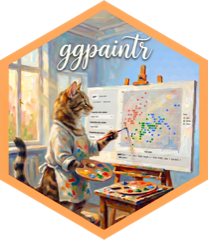

```{r setup, include=FALSE}
knitr::opts_chunk$set(
  collapse = TRUE,
  comment = "#>",
  warning = FALSE,
  message = FALSE
)

if (!requireNamespace("ggpaintr", quietly = TRUE)) {
  devtools::install(quiet = TRUE)
}
library(ggpaintr)
```

# ggpaintr 

Turn a ggplot-like formula string into a Shiny app. Placeholder keywords
inside the formula (`var`, `text`, `num`, `expr`, `upload`) become input
widgets automatically, and the same parsed object drives the UI, the
runtime, and the generated code pane.

<!-- badges: start -->
[](https://lifecycle.r-lib.org/articles/stages.html)
<!-- badges: end -->

## Installation

```r
# install.packages("pak")
pak::pkg_install("willju-wangqian/ggpaintr")
```

## Quick start

Paste this into an R session:

```r
library(ggpaintr)

ptr_app("
ggplot(data = iris, aes(x = var, y = var)) +
  geom_point(aes(color = var), size = num) +
  labs(title = text) +
  facet_wrap(expr)
")
```

That single call parses the formula once and returns a running Shiny
app. Every `var`, `num`, `text`, and `expr` token becomes a widget in
the sidebar; editing a widget and clicking **Update plot** re-renders
the plot and refreshes the generated ggplot code on the side. No Shiny
UI or server code was written.

For a bslib-themed variant with the same API, use
`ptr_app_bslib()`.

## Formula syntax

A ggpaintr formula is a normal ggplot call as a string, with
placeholder keywords anywhere a value would normally go. Each keyword
maps to one widget and one runtime value.

| Keyword  | Widget                         | Runtime value                 | Typical use                                        |
|----------|--------------------------------|-------------------------------|----------------------------------------------------|
| `var`    | column picker (`shinyWidgets::pickerInput`)  | column symbol                 | pick a column from the data frame                  |
| `text`   | `textInput`                    | string                        | free text (axis labels, titles, color names)       |
| `num`    | `numericInput`                 | numeric                       | a number (point size, alpha, threshold)            |
| `expr`   | code input                     | parsed R expression           | raw R code (facet specs, label formulas)           |
| `upload` | `fileInput` + dataset name     | data frame (`.csv` / `.tsv` / `.rds` / `.xlsx` / `.xls` / `.json`) | let the app receive a dataset at runtime           |

Slot context decides each widget's label and help text: the surrounding
argument name, the layer it appears in, and the keyword together pick
the default copy. You can override any of that with `ui_text`.

`var` is a **column picker**. Formula-level transforms such as
`aes(x = var + 1, y = log(var))` go in the formula itself — the picker
still returns the column symbol, and the transform is applied around it.

`expr` accepts anything `rlang::parse_expr()` can read, with a denylist
guard against dangerous calls. The guard is controlled by the
`expr_check` argument on `ptr_app()` / `ptr_app_bslib()`, which defaults
to `TRUE` and should stay on unless you know what you are doing.

`upload` accepts `.csv`, `.tsv`, `.rds`, `.xlsx`, `.xls`, and `.json` (array of records, with nested objects flattened) and normalizes column names automatically after read-in. Excel and JSON readers require the suggested packages `readxl` and `jsonlite` respectively. For local data with non-syntactic column names, call `ptr_normalize_column_names()` once before passing the frame in.

For a worked walkthrough of every keyword, see
`vignette("ggpaintr-workflow")`.

## Three levels of use

ggpaintr is organized around three levels of integration. Pick the
lowest level that covers what you need — the higher the level, the
less code you write; the lower the level, the more control you have.

### Level 1 — Turn-key app

Call `ptr_app()` or `ptr_app_bslib()`. No Shiny code required. This
is the right entry point for teaching, demoing, or quick data
exploration.

```r
ptr_app(
  "ggplot(data = iris, aes(x = var, y = var)) +
     geom_point() +
     labs(title = text)"
)
```

Both wrappers accept `ui_text` (copy overrides) and `placeholders`
(custom placeholder types). `ptr_app_bslib()` adds `theme` and
`title` for the bslib shell.

Read `vignette("ggpaintr-workflow")` for the full list of arguments,
the three data-source paths (`data = <frame>`, the `upload` keyword,
and `ptr_normalize_column_names()` for non-syntactic local data), and
a walk-through of what happens when you click **Update plot**.

### Level 2 — Embed in your own Shiny app

When you already have a Shiny app and want ggpaintr's widgets and
runtime to live inside it, use the embedding API:

- `ptr_input_ui()` and `ptr_output_ui()` drop the generated controls
  and output panes into any UI.
- `ptr_server()` wires up the server side in one call; or compose the
  individual `ptr_register_*()` helpers (`ptr_register_draw`,
  `ptr_register_plot`, `ptr_register_code`, `ptr_register_error`) for
  finer control.
- `ptr_server_state()` + `ptr_setup_controls()` expose the underlying
  reactive state for apps that want to observe it.
- `ptr_build_ids()` lets you rename every top-level element id to
  match your own conventions.
- `ui_text` rewrites labels, help text, and shell chrome at any of
  six sections (`shell`, `upload`, `layer_checkbox`, `defaults`, `params`, `layers`).

Read `vignette("ggpaintr-extensibility")` for a full runnable embed
app, the complete `ui_text` override catalog, and the six-section
merge precedence rules.

### Level 3 — Low-level developer API

When Level 2 is not enough — batch reports, custom `renderPlot()`
blocks, programmatic code generation, or building new ggpaintr-aware
packages — drop to the parse / exec / extract helpers:

- `ptr_parse_formula()` parses a formula once and returns the shared
  object that every other helper consumes.
- `ptr_runtime_input_spec()` enumerates the input ids the runtime
  expects, so you can build an input list without a Shiny session.
- `ptr_exec()` runs the parsed formula against that input list,
  headlessly.
- `ptr_extract_plot()`, `ptr_extract_code()`, `ptr_extract_error()`
  pull the rendered plot, the generated code string, and any runtime
  error out of the result.
- `ptr_gg_extra()` and `ptr_assemble_plot()` let a host app merge
  extra ggplot components into the embedded plot while keeping the
  code pane in sync with what was actually drawn.
- `ptr_missing_expr()` is the sentinel a custom `resolve_expr` hook
  returns when its widget has no value yet.

Read `vignette("ggpaintr-extensibility")` for runnable Level 3
recipes: a headless plot rendered to a png file with no Shiny, a
custom `renderPlot()` that post-processes the ggplot object, a host
app injecting layers with `ptr_gg_extra()`, and programmatic code
generation with `ptr_extract_code()`.

### Customizing placeholders

Custom widget types — a date picker, a slider, a column-subset
chooser — are defined with `ptr_define_placeholder()` and mixed in
with `ptr_merge_placeholders()`. They plug into every level:

- Level 1: `ptr_app(formula, placeholders = ...)`.
- Level 2: `ptr_server(..., placeholders = ...)`.
- Level 3: `ptr_parse_formula(formula, placeholders = ...)`.

A placeholder definition supplies up to five hooks (`build_ui`,
`resolve_expr`, `resolve_input`, `bind_ui`, `prepare_eval_env`) of
which the first two are required.

See `vignette("ggpaintr-placeholder-registry")` for the full hook
contract, a minimal end-to-end example, and the recipe for
replacing a built-in widget with a custom one.

## Where to go next

- **`vignette("ggpaintr-workflow")`** — formula syntax, every
  placeholder keyword, every `ptr_app()` argument, data-source
  paths, and a conceptual tour of what happens between click and
  plot. Read this first.
- **`vignette("ggpaintr-extensibility")`** — Level 2 (embed in an
  existing Shiny app, override `ui_text`, custom ids) and Level 3
  (headless plot, custom `renderPlot()`, `ptr_gg_extra()`,
  programmatic code generation). Read this when you outgrow
  `ptr_app()`.
- **`vignette("ggpaintr-placeholder-registry")`** — the five
  placeholder hooks, required vs optional, worked examples of
  adding a new widget type, and the recipe for replacing a
  built-in placeholder.

The [pkgdown reference](https://willju-wangqian.github.io/ggpaintr/)
lists every exported function.

## Stability guarantees

- The five built-in placeholders — `var`, `text`, `num`, `expr`,
  `upload` — are stable. Custom placeholders share the same parse,
  UI, runtime, and copy-rule path.
- `upload` accepts `.csv`, `.tsv`, `.rds`, `.xlsx`, `.xls`, and `.json`. Other formats are outside the current boundary.
- The supported surface is the exported `ptr_*` API (see
  `NAMESPACE`). Anything not exported is implementation detail.
- Only the top-level ids exposed by `ptr_build_ids()` are
  configurable.
- Runtime failures are labeled `Input error` or `Plot error` and
  stay on the shared inline error path.
- Raw placeholder ids such as `"ggplot_3_2"` are not a stable
  hand-authored API — discover them with
  `ptr_runtime_input_spec()`. Deeper traversal details
  (`index_path` encoding, internal companion id conventions)
  remain package internals.
- The formula-string model is the current author-facing interface;
  future hardening should compile it into a richer internal
  runtime contract rather than replace that authoring model
  outright.

## Current behavior boundary

- Structural formula errors fail early during parsing.
- `var` with no data source fails while preparing the UI.
- `var` is a column picker. Formula-level transforms such as
  `var + 1` or `log(var)` go in the formula text, not as input
  values.
- Local data with non-syntactic column names must pass through
  `ptr_normalize_column_names()` first. Uploads apply the same
  normalization automatically.
- Missing local data objects are deferred to draw-time inline
  errors.
- Advanced integrations can customize the plot through
  `ptr_extract_plot()` inside a user-owned `renderPlot()`, with
  `ptr_gg_extra()` keeping the code pane in sync.
