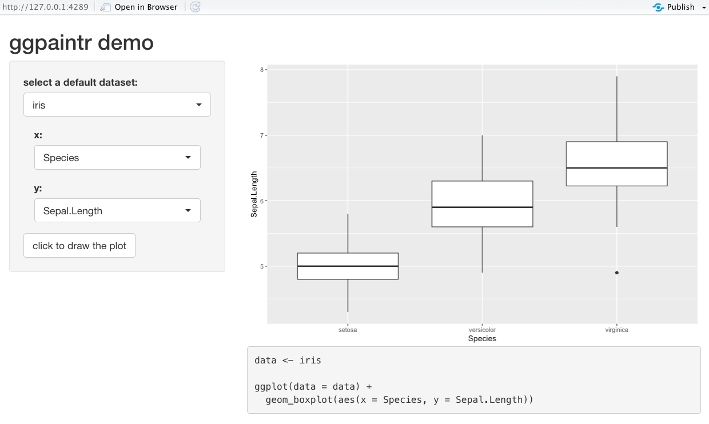

```{r setup, include=FALSE}
knitr::opts_chunk$set(
  collapse = TRUE,
  comment = "#>",
  fig.path = "man/figures/README-",
  out.width = "100%",
  echo=TRUE,
  warning = FALSE,
  message = FALSE
)
```

# ggpaintr  

An open-source R package for building modularized shiny apps with plotting functionalities using `ggplot2` and the Grammar of Graphics

## Installation

You can install the development version from Github with:

```{r, eval=FALSE, echo=TRUE}
# install.packages("devtools")
devtools::install_github("willju-wangqian/ggpaintr")
```


## Building a shiny app that can make plots with `ggplot2`

```{r shinyiris1, echo=FALSE, fig.cap="Some Caption"}

```

This figure shows a shiny app that can make plots with `ggplot2`. After selecting a dataset, the shiny app allows users to map variables (or columns) in the dataset to `x` and `y`. It generates a plot using `ggplot2` and shows the corresponding `R` code. The reactivity on the mappings are built up so that changing mappings variables for `x` or `y` will change the resulting plot after clicking the "draw" button. Moreover, changing the selected dataset will automatically update the available choices for `x` and `y`. Without the help of `ggpaintr`, building such a shiny app at least requires the following steps:

- have UI components for `x` and `y` so that `input$x` and `input$y` are available
- dynamically render UI components for `x` and `y` so that the available choices depend on the selected data set
- figure out how to generate a `ggplot2` plot using `input$x` and `input$y` since the inputs are strings. One option is to use `aes_string()`
- figure out the `R` code for generating the resulting plot
- render the plot
- render the code

This might look involved, but what if this shiny app needs more functionalities? If the shiny app needs more mappings, such as `color` or `fill`, it will add more UI component, modify the server part so that the inputs can be correctly captured. If the shiny app wants to allow users to flip the coordinates using `coord_flip()` or adding labels using `labs()`, building this shiny app becomes even more involved. Additionally, maintaining and updating the shiny app can be challenging as well since many aspects of the shiny app would be modified.

However, we can build such a shiny app using `ggpaintr` with the following code. 

```{r, include = TRUE, eval = FALSE, attr.source='.numberLines'}
library(ggpaintr)
library(shiny)
library(tidyverse)
library(shinyWidgets)
library(palmerpenguins)

# Define UI for application that draws a histogram
ui <- fluidPage(
  
  # Application title
  titlePanel("ggpaintr demo"),
  
  # Sidebar with a slider input for number of bins
  sidebarLayout(
    sidebarPanel(
      pickerInput("defaultData", "select a default dataset:",
                  choices = c("iris", "mtcars","penguins", "faithfuld"),
                  selected = "",
                  multiple = TRUE,
                  options = pickerOptions(maxOptions = 1)),
      uiOutput("controlPanel"),
      actionButton("draw", "click to draw the plot"),
    ),
    
    # Show a plot of the generated distribution
    mainPanel(
      plotOutput("outputPlot"),
      verbatimTextOutput('outputCode')
    )
  )
)

# Define server logic required to draw a histogram
server <- function(input, output) {
  
  control_id <- "control_id"
  
  # data
  data_container <- reactive({
    req(input$defaultData)
    get(input$defaultData)
  })
  
  # construct paintr object
  paintr_rctv <- reactive({
    
    req(data_container())
    
    paintr(control_id,
           data_container(), data_path = input$defaultData,
           geom_boxplot(aes(x, y)) 
    )
    
  })
  
  # place ui
  output$controlPanel <- renderUI({
    req(paintr_rctv())
    
    column(
      12,
      paintr_get_ui(paintr_rctv(), "x"),
      paintr_get_ui(paintr_rctv(), "y"),
    )
  })
  
  # take results and plot
  observe({
    req(paintr_rctv(), data_container(), input$defaultData)
    data <- data_container()
    
    paintr_results <- paintr_plot_code(paintr_rctv())
    
    # Plot output
    output$outputPlot <- renderPlot({
      
      paintr_results[['plot']]
      
    })
    
    # Code output
    output$outputCode <- renderText({
      
      paintr_results[['code']]
      
    })
    
  }) %>% bindEvent(input$draw)
  
  
}

# Run the application
shinyApp(ui = ui, server = server)
```

Many things are hidden and handled by functions in `ggpaintr`. And updating this shiny app can be relatively easy with the help of `ggpaintr`: by changing the `ggplot2` alike expression at line 51 into

```{r, echo=TRUE, eval=FALSE}
# add mapping for fill
geom_boxplot(aes(x, y, fill)) +
  coord_flip +        # allow users to flip coordinate
  labs(x, y, title)   # allow users to add labels for x-axis, y-axis, and title
```

and adding more elements in `output$controlPanel <- renderUI()` at line 57:

```{r, echo=TRUE, eval=FALSE}
# place ui
output$controlPanel <- renderUI({
  req(paintr_rctv())
  
  column(
    12,
    paintr_get_ui(paintr_rctv(), "x"),
    paintr_get_ui(paintr_rctv(), "y"),
    paintr_get_ui(paintr_rctv(), "fill"),
    paintr_get_ui(paintr_rctv(), "coord_flip"), # add UI for coord_flip()
    paintr_get_ui(paintr_rctv(), "labs"),       # add UI for labs()
  )
})
```

we can build a shiny app with the updated features as shown in Figure X. We can see that the shiny app now allows users to flip coordinates and set labels. The plot and corresponding `R` code can be updated accordingly as well.

```{r shinyiris2, echo=FALSE, fig.cap="Some Caption"}
knitr::include_graphics("man/figures/ggpaintr_iris_2.png")
```

## Building a shiny app using `ggpaintr`

A shiny app called `ggpaintr_app` is built with the `ggpaintr` package and included in the package. `ggpaintr_app` not only demonstrates the functionality of `ggpaintr`, but also serves as a shiny app for those unfamiliar with the Grammar of Graphics or ggplot2 but want to create a plot using ggplot2. Some design of `ggpaintr_app` can also provide reference for package/shiny app developers. To start the app:

```{r, eval=FALSE, echo=TRUE}
library(ggpaintr)

run_ggpaintr_app()
```

## Development

+   location for external data: `inst/extdata`
+   location for example shiny app: `inst/shiny`
+   location for files that need to be uploaded but are not part of the package: `preconsideration/<folder_name>`
+   coding style consistency: please try to use `underscores_in_variable_names` and (maybe) `camelCase` for web-related names...

## Generate plot icons

+   the code that generates the plot icons: `preconsideration/generate_plot_icon`
+   we can save the generated icons into `preconsideration/saved_plot_icon` or copy them to `inst/shiny/ggpaintr_app/www/img_button`
+   different functions for `actionButton`
    +   `shinyWidgets::actionBttn`, [link](https://bttn.surge.sh/)
    +   `actionButton`: this is the default and we can specify the `style` attribute
    +   `bsButton`: this includes both the `actionButton` and `checkboxInput`, but we don't have much room for `style` 

## Future work

- extensibility + 

## Change log

#### version number: 0.0.9.8

- fixed `DT` filtering problem in `ggpaintr_app`

- Todo: ???

#### version number: 0.0.9.7

- fixed code for numeric input
- allow categorical variables to have less than 3 levels

- Todo - `ggpaintr_app`:
  - filters from `DT` will invalidate the code

#### version number: 0.0.9.6

- alpha as numeric
- n < 3 colors

- added four chart types, next: update functions in the package

- change expression by clicking the plot icon
- test if ui functions can be added
- how to add customized handler functions?

#### version number: 0.0.9.5

- Updates:
  - introduced `paintr_obj` and `paintr()`, which use a grammar similar to `ggplot2` to specify and control all elements or pieces built in the shiny app
  - use one function to build reactivity of `color` or `fill` so that they can work with `paintr_plot_code`

- TODO:
  - documentations and dependencies
  - write-ups
  - download plot
  - test and finalize code then push to main

#### version number: 0.0.9.4

- heuristics:
  - parameters of handlers
  - parameters of ui modules
  - returns of handlers

+ TODO: 
  - documentations 
  - [X] icon position or size 
  - writeup
    - the concept of grammar of graphics
    - why this package can be useful
    - how to use the package
  - [X] how to wrap up the part of scale_color
  - template?
  - download plot
  - [X] aes then comma

#### version number: 0.0.9.3

+   updates:
    +   the app is now able to show code that generates the plot
    +   dynamic color picker
+   TODO:
    +   update ui
    +   implement other plot types
    +   extend the current functionality: added more handlers (for example one for `labs()`)
    +   documentations

#### version number: 0.0.9.2

+   updates:
    +   `*Handler`s are introduced for plot generation
    +   added bar chart

#### version number: 0.0.9.1

+   updates:
    +   new ui
    +   example for box plot finished
+   TODO:
    +   update the geomGenerators
        +   each line of Grammar of Graphics has its onw handler
        +   a function that collects all handlers
        +   find a way to connect handlers to its ui components
    +   allow color pickers to respond to the selected variable
    +   update ui
    +   implement other plot types
    +   display code
    


