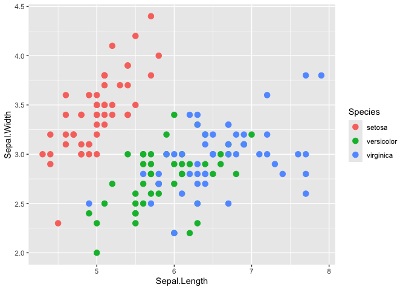

# ggpaintr 

<!-- badges: start -->

[](https://lifecycle.r-lib.org/articles/stages.html)
<!-- badges: end -->

## Overview

ggpaintr turns a ggplot-like formula into a running Shiny app. You write
a single `ggplot()` call — passed directly as an unquoted expression
(the primary form), or as a string (the fallback) — and drop placeholder
keywords (`ppVar`, `ppText`, `ppNum`, `ppExpr`, `ppUpload`) anywhere a
value would normally go. ggpaintr does the rest: each keyword becomes an
input widget, the same parsed object drives the UI, the plot, and a live
code pane, and editing any widget re-renders the plot.

No Shiny UI or server code required. If you can write a ggplot call, you
can ship an interactive version of it.

## Installation

``` r
# Install the development version from GitHub:
# install.packages("pak")
pak::pkg_install("willju-wangqian/ggpaintr")
```

## Usage

``` r
library(ggpaintr)

# Primary form: pass the ggplot() call directly as an unquoted expression.
ptr_app(
  ggplot(data = iris, aes(x = ppVar, y = ppVar)) +
    geom_point(aes(color = ppVar), size = ppNum) +
    labs(title = ppText) +
    facet_wrap(ppExpr)
)
```

That single call returns a running Shiny app. Each placeholder in the
formula becomes one widget:

-   the three `ppVar` tokens → column pickers populated from `iris`,
-   `ppNum` → a numeric input (point size),
-   `ppText` → a text input (plot title),
-   `ppExpr` → a code box for the facet spec (e.g. `vars(Species)`).

`library(ggpaintr)` also attaches `ggplot2`, so bare `ggplot()` /
`aes()` / `geom_*()` calls work directly in the formula expression. To
reuse a formula across calls, store it with `rlang::expr()` and splice
it in with `!!` — `f <- rlang::expr(ggplot(...)); ptr_app(!!f)`. The
string form (`ptr_app("ggplot(...)")`) remains a supported fallback,
handy when a formula is built or fetched as text. For a grid layout, use
`ptr_app_grid()`. To swap in a custom page shell or theme, write a thin
wrapper on top of the public primitives.

The `ptr_app()` call above needs a Shiny session to run, so it is not
evaluated here. But each `pp*` token is a plain identity function, so
the **same formula without `ptr_app()` is ordinary, runnable `ggplot2`**
— drop the placeholders into your plot, sketch it as a static chart
first, then wrap it in `ptr_app()` when you want the widgets:

``` r
ggplot(iris, aes(x = ppVar(Sepal.Length), y = ppVar(Sepal.Width), color = ppVar(Species))) +
  geom_point(size = ppNum(3)) +
  labs(x = "Sepal.Length", y = "Sepal.Width", color = "Species")
```



Here `ppVar(Sepal.Length)` evaluates to `Sepal.Length` and `ppNum(3)` to
`3`, so the chart renders exactly as plain ggplot2 — the tokens only
become widgets once the expression is handed to `ptr_app()`.

Handing that exact expression to `ptr_app()` launches the interactive
app, and the value inside each placeholder becomes that widget’s
**initial selection** — so the app boots with `x = Sepal.Length`,
`y = Sepal.Width`, `color = Species`, `size = 3` pre-selected and
renders the very same figure straight away, ready to be re-pointed at
other columns:

``` r
ptr_app(
  ggplot(iris, aes(x = ppVar(Sepal.Length),
                   y = ppVar(Sepal.Width), 
                   color = ppVar(Species))) +
    geom_point(size = ppNum(3))
)
```

The expression need not be inline. Capture it once with `rlang::expr()`
and reuse it — `ptr_app()` resolves a formula stored in a variable by
name (no `!!` needed), so you can build, inspect, or share the formula
before launching the app:

``` r
formula_iris <- rlang::expr(
  ggplot(iris, aes(x = ppVar(Sepal.Length), 
                   y = ppVar(Sepal.Width), 
                   color = ppVar(Species))) +
    geom_point(size = ppNum(3))
)

ptr_app(formula_iris)
```

## RStudio addin

ggpaintr ships an RStudio addin that turns a plain ggplot expression
into a placeholder formula without typing the `pp*` tokens by hand.
Highlight a piece of your code, run the addin, and pick a placeholder
from a command palette — the selection is rewritten in place (`mpg` →
`ppVar(mpg)`; nothing highlighted inserts `ppVar()` with the cursor
between the parens). The list is ordered by what you highlighted — a
bare name surfaces the column pickers (`ppVar`), a number `ppNum`, a
string `ppText`, a call the layer/verb toggles (`ppLayerOff` /
`ppVerbSwitch`) — and any placeholder you registered this session
appears automatically. The palette’s **Wrap in app** button wraps the
whole selection in `{ … } |> ptr_app()` to scaffold a runnable app.


Run it from the **Addins** menu ▸ *ggpaintr placeholder*. To bind a
keyboard shortcut (the addin must be **installed**, not just
`load_all()`-ed, to appear in the dialog):

1.  *Tools ▸ Addins ▸ Browse Addins…*, then the *Keyboard Shortcuts…*
    button. (Or *Tools ▸ Modify Keyboard Shortcuts…* and type “ggpaintr”
    in the search box.)
2.  Click the *Shortcut* cell on the *ggpaintr placeholder* row.
3.  Press your combination — e.g. **Cmd+Shift+G** (macOS) or
    **Ctrl+Shift+G** (Windows/Linux). Any free combination works.
4.  *Apply*.

## More topics

-   **`vignette("ggpaintr-tutorial")` — *Tutorial*.** A guided walk from
    a one-line `ptr_app()` formula, through defining your own
    placeholders (every argument of the three constructors
    `ptr_define_placeholder_value()` / `_consumer()` / `_source()`), to
    embedding several plots in your own Shiny app with `ptr_ui()` /
    `ptr_server()` and sharing one control across them via
    `ptr_shared()` / `ptr_shared_panel()` / `ptr_shared_server()`. Opens
    with a tour of the five built-in placeholder keywords.

-   **`vignette("ggpaintr-safety")` — *Safety*.** What `expr_check` does
    and when (never) to turn it off, the denylist + AST-walker safety
    model, and the upload trust boundary.

-   **`vignette("ggpaintr-llm")` — *Using ggpaintr from an LLM with
    ellmer*.** Wire ggpaintr up as an LLM-callable tool with ellmer:
    register the primer and the topic-lookup tool, inspect what the
    model sees, swap providers/models, and test without spending tokens.

The [pkgdown reference](https://willju-wangqian.github.io/ggpaintr/)
lists every exported function. A longer, book-length introduction to
ggpaintr is planned.
