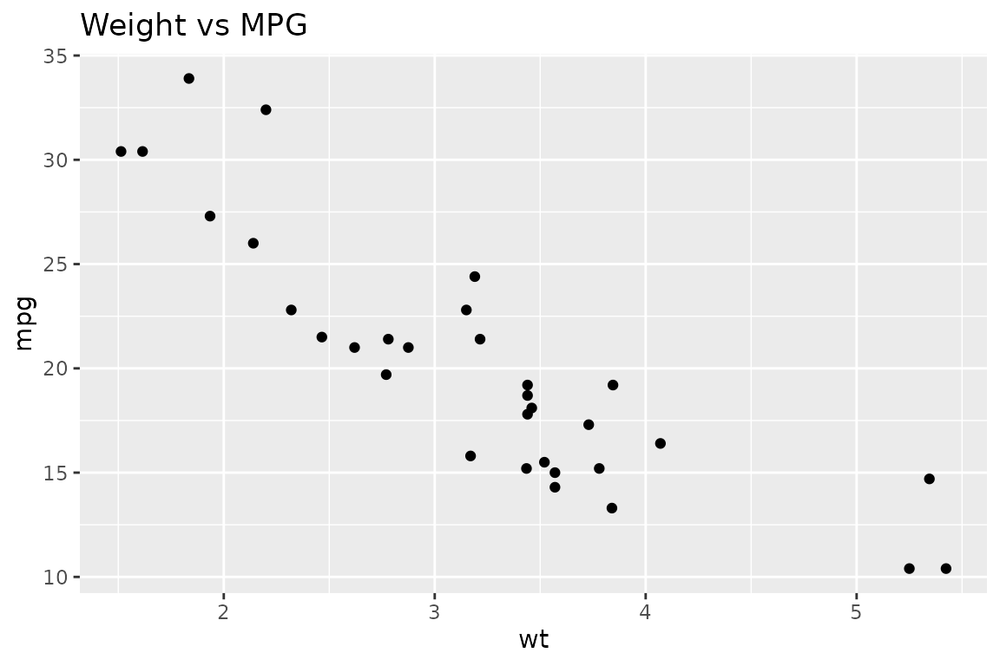

# ggpaintr Extensibility

``` r
library(ggpaintr)
library(ggplot2)
library(shiny)
```

## 1. Motivation

[`ptr_app()`](https://willju-wangqian.github.io/ggpaintr/reference/ptr_app.md)
(Level 1, covered in
[`vignette("ggpaintr-workflow")`](https://willju-wangqian.github.io/ggpaintr/articles/ggpaintr-workflow.md))
is the fastest path from a formula to a running Shiny app. It also owns
the entire page: the sidebar, the draw button, the plot, and the code
output. That is perfect for teaching and quick demos, and wrong for
anything else.

This vignette covers the two situations where
[`ptr_app()`](https://willju-wangqian.github.io/ggpaintr/reference/ptr_app.md)
is not enough:

- **Level 2 — Embed ggpaintr in your own Shiny app.** You already have a
  Shiny app (a dashboard, a course site, a client deliverable) and you
  want one of its tabs to hold a ggpaintr-driven plot. You need to
  control layout, copy, and element ids; you do not want to rewrite the
  runtime.
- **Level 3 — Drive the runtime without a full app.** You want a plot
  from a formula without launching Shiny (batch reports, test fixtures),
  or you want to post-process the `ggplot` object before rendering, or
  you want to generate ggplot code strings programmatically.

Both levels are built on the same parse/compose pipeline that
[`ptr_app()`](https://willju-wangqian.github.io/ggpaintr/reference/ptr_app.md)
uses internally. The public API gives you exactly the extension seams
[`ptr_app()`](https://willju-wangqian.github.io/ggpaintr/reference/ptr_app.md)
uses itself — no hidden state, no private bridge functions.

If your goal instead is to add a *new placeholder type* (a date picker,
a slider, a colour well), skip to
[`vignette("ggpaintr-placeholder-registry")`](https://willju-wangqian.github.io/ggpaintr/articles/ggpaintr-placeholder-registry.md).
That vignette owns the placeholder-registry contract end-to-end; this
one tells you how to register those placeholders into an embedded or
headless workflow once you have them.

## 2. Extensibility model

            Level 1 — turn-key app
            ┌────────────────────────────────────────────┐
            │ ptr_app(formula)        ptr_app_bslib(...) │
            └───────────────┬────────────────────────────┘
                            │ builds on
                            ▼
            Level 2 — embed in your own Shiny app
            ┌────────────────────────────────────────────┐
            │ ptr_input_ui()          ptr_output_ui()    │
            │ ptr_server_state()      ptr_build_ids()    │
            │ ptr_setup_controls()    ptr_register_draw()│
            │ ptr_register_plot()     ptr_register_error()│
            │ ptr_register_code()     ptr_server()        │
            └───────────────┬────────────────────────────┘
                            │ builds on
                            ▼
            Level 3 — developer API
            ┌────────────────────────────────────────────┐
            │ ptr_parse_formula()    ptr_runtime_input_spec()
            │ ptr_exec()             ptr_assemble_plot()    │
            │ ptr_extract_plot()     ptr_extract_code()     │
            │ ptr_extract_error()    ptr_gg_extra()         │
            │ ptr_missing_expr()                           │
            └────────────────────────────────────────────┘

Each level is a strict superset of the surface below it. Level 1 is
[`ptr_server()`](https://willju-wangqian.github.io/ggpaintr/reference/ptr_server.md) +
a fluid-page shell;
[`ptr_server()`](https://willju-wangqian.github.io/ggpaintr/reference/ptr_server.md)
is
[`ptr_server_state()`](https://willju-wangqian.github.io/ggpaintr/reference/ptr_server_state.md) +
the five `ptr_register_*()` helpers; and the register helpers read
reactive values maintained by
[`ptr_server_state()`](https://willju-wangqian.github.io/ggpaintr/reference/ptr_server_state.md)
and compute by calling Level-3 primitives.

Customization also lives at every level. The options below are shared by
all three entry points and are documented once here:

- **`ui_text`** — override labels, help text, placeholder hints, and the
  fallback text for empty inputs. See §3e.
- **`placeholders`** — register new placeholder keywords or replace
  built-ins. See
  [`vignette("ggpaintr-placeholder-registry")`](https://willju-wangqian.github.io/ggpaintr/articles/ggpaintr-placeholder-registry.md).
- **`expr_check`** — tune the safety check applied to user-supplied
  `expr` inputs. See
  [`vignette("ggpaintr-workflow")`](https://willju-wangqian.github.io/ggpaintr/articles/ggpaintr-workflow.md),
  §3.4.

## 3. Level 2 — embed ggpaintr in your own Shiny app

### 3a. Minimal embed

The smallest embed that still behaves like
[`ptr_app()`](https://willju-wangqian.github.io/ggpaintr/reference/ptr_app.md).
You hand ggpaintr the formula through
[`ptr_server_state()`](https://willju-wangqian.github.io/ggpaintr/reference/ptr_server_state.md),
place its input and output widgets inside your own layout, and wire the
five default binders.

``` r
ui <- fluidPage(
  titlePanel("Embedded ggpaintr"),
  sidebarLayout(
    sidebarPanel(
      ptr_input_ui()
    ),
    mainPanel(
      ptr_output_ui()
    )
  )
)

server <- function(input, output, session) {
  ptr_state <- ptr_server_state(
    "ggplot(data = mtcars, aes(x = var, y = var)) +
       geom_point() +
       labs(title = text)"
  )

  ptr_setup_controls(input, output, ptr_state)
  ptr_register_draw(input, ptr_state)
  ptr_register_plot(output, ptr_state)
  ptr_register_error(output, ptr_state)
  ptr_register_code(output, ptr_state)
}

shinyApp(ui, server)
```

Six public calls are doing the work:

- [`ptr_input_ui()`](https://willju-wangqian.github.io/ggpaintr/reference/ptr_input_ui.md)
  renders a
  [`uiOutput()`](https://rdrr.io/pkg/shiny/man/htmlOutput.html) slot for
  the generated controls plus a “Update plot” action button.
- [`ptr_output_ui()`](https://willju-wangqian.github.io/ggpaintr/reference/ptr_output_ui.md)
  renders the
  [`plotOutput()`](https://rdrr.io/pkg/shiny/man/plotOutput.html), the
  error [`uiOutput()`](https://rdrr.io/pkg/shiny/man/htmlOutput.html),
  and a
  [`verbatimTextOutput()`](https://rdrr.io/pkg/shiny/man/textOutput.html)
  for the generated code.
- `ptr_server_state(formula)` parses the formula and returns a
  `ptr_state` object holding reactive values: `obj`, `runtime`,
  `extras`, `var_ui_list`, and a few shared metadata slots. This object
  is what you pass around to every binder.
- [`ptr_setup_controls()`](https://willju-wangqian.github.io/ggpaintr/reference/ptr_setup_controls.md)
  observes the dynamic `var` controls (so their choices update as
  uploads resolve) and renders the tabbed control panel into
  `ids$control_panel`.
- [`ptr_register_draw()`](https://willju-wangqian.github.io/ggpaintr/reference/ptr_register_draw.md)
  observes the draw button and updates `ptr_state$runtime()` with the
  latest
  [`ptr_exec()`](https://willju-wangqian.github.io/ggpaintr/reference/ptr_exec.md)
  result.
- [`ptr_register_plot()`](https://willju-wangqian.github.io/ggpaintr/reference/ptr_register_plot.md)
  /
  [`ptr_register_error()`](https://willju-wangqian.github.io/ggpaintr/reference/ptr_register_error.md)
  /
  [`ptr_register_code()`](https://willju-wangqian.github.io/ggpaintr/reference/ptr_register_code.md)
  read the reactive result and render it.

Every binder accepts `ptr_state` as its contract. None of them touch
private state on the state object — you can drop any binder you do not
need (for example,
[`ptr_register_code()`](https://willju-wangqian.github.io/ggpaintr/reference/ptr_register_code.md)
if you do not want code output), and you can replace any of them with
your own implementation that reads `ptr_state$runtime()`.

### 3b. Splitting plot, code, and error panels

Embedded apps often want the plot, the code, and the error message in
different places. Because each `ptr_register_*()` helper writes to a
single output id, you can place each output wherever you want in the
layout.

``` r
ui <- fluidPage(
  titlePanel("ggpaintr with split outputs"),
  fluidRow(
    column(4,
      tags$h4("Controls"),
      uiOutput("controlPanel"),
      actionButton("draw", "Update plot")
    ),
    column(8,
      tabsetPanel(
        tabPanel("Plot",    plotOutput("outputPlot")),
        tabPanel("Code",    verbatimTextOutput("outputCode")),
        tabPanel("Status",  uiOutput("outputError"))
      )
    )
  )
)

server <- function(input, output, session) {
  ptr_state <- ptr_server_state(
    "ggplot(data = mtcars, aes(x = var, y = var)) + geom_point()"
  )

  ptr_setup_controls(input, output, ptr_state)
  ptr_register_draw(input, ptr_state)
  ptr_register_plot(output, ptr_state)
  ptr_register_code(output, ptr_state)
  ptr_register_error(output, ptr_state)
}

shinyApp(ui, server)
```

The three register helpers are independent — each one writes to the
output id named in `ptr_state$ids`. The default ids above match the
defaults from
[`ptr_build_ids()`](https://willju-wangqian.github.io/ggpaintr/reference/ptr_build_ids.md),
which is why we did not have to pass `ids = ...` anywhere. Customizing
ids is §3d.

### 3c. Multiple ggpaintr instances in one session

Put more than one ggpaintr instance in the same Shiny session — two
tabs, a side-by-side comparison, a module called several times — and
their widget ids collide by default. Namespace each instance with `ns =`
to keep them disjoint.

`ns` is a function of the shape `character -> character`. The default
`shiny::NS(NULL)` is the identity (no prefix), which reproduces pre-`ns`
behavior. Pass `shiny::NS("my_prefix")` to prefix every widget id
ggpaintr owns — the top-level ids on `ptr_state$ids`, the
per-placeholder input ids, the checkbox ids, and the dynamic `var`
output ids — with `"my_prefix-"`.

The same `ns` must be threaded through three call sites per instance:
[`ptr_input_ui()`](https://willju-wangqian.github.io/ggpaintr/reference/ptr_input_ui.md),
[`ptr_output_ui()`](https://willju-wangqian.github.io/ggpaintr/reference/ptr_output_ui.md),
and
[`ptr_server_state()`](https://willju-wangqian.github.io/ggpaintr/reference/ptr_server_state.md)
(or its wrapper
[`ptr_server()`](https://willju-wangqian.github.io/ggpaintr/reference/ptr_server.md)).
The `ids =` argument is independent — sharing the same `custom_ids`
across instances is fine, because `ns` is what disambiguates them.

``` r
ns_a <- shiny::NS("plot_a")
ns_b <- shiny::NS("plot_b")

ui <- fluidPage(
  tabsetPanel(
    tabPanel("A",
      fluidRow(
        column(4, ptr_input_ui(ns = ns_a)),
        column(8, ptr_output_ui(ns = ns_a))
      )),
    tabPanel("B",
      fluidRow(
        column(4, ptr_input_ui(ns = ns_b)),
        column(8, ptr_output_ui(ns = ns_b))
      ))
  )
)

server <- function(input, output, session) {
  ptr_server(
    input, output, session,
    formula = "ggplot(data = mtcars, aes(x = var, y = var)) + geom_point()",
    ns      = ns_a
  )
  ptr_server(
    input, output, session,
    formula = "ggplot(data = iris, aes(x = var, y = var)) + geom_point()",
    ns      = ns_b
  )
}
```

Inside
[`shiny::moduleServer()`](https://rdrr.io/pkg/shiny/man/moduleServer.html),
pass `session$ns` — it is a namespace function identical in shape to
`shiny::NS(id)` for the enclosing module id, so the UI (built with
`shiny::NS(id)`) and the server (using `session$ns`) agree. No
double-prefixing occurs because ggpaintr applies `ns` exactly once to
raw ids.

``` r
tab_ui <- function(id) {
  ns <- shiny::NS(id)
  shiny::tagList(ptr_input_ui(ns = ns), ptr_output_ui(ns = ns))
}

tab_server <- function(id, formula) {
  shiny::moduleServer(id, function(input, output, session) {
    ptr_server(input, output, session, formula = formula, ns = session$ns)
  })
}
```

The single failure mode is reusing the same `ns` (or leaving it at its
default) across two instances in the same session. Then the resolved ids
collide and Shiny silently keeps only the last `output[[id]] <-`
assignment — one instance appears empty. Sanity check any wiring by
inspecting the resolved ids in the console:

``` r
state_a <- ptr_server_state(formula_a, ns = ns_a)
state_b <- ptr_server_state(formula_b, ns = ns_b)
length(intersect(unlist(state_a$ids), unlist(state_b$ids)))  # expect 0
```

### 3d. Custom ids

[`ptr_build_ids()`](https://willju-wangqian.github.io/ggpaintr/reference/ptr_build_ids.md)
returns a validated list describing the five top-level Shiny ids
ggpaintr uses. Override it when your host app already uses one of the
default names, or when you want ggpaintr outputs in specific containers.

Full signature, with defaults:

``` r
ptr_build_ids(
  control_panel = "controlPanel",  # uiOutput that holds the tabbed controls
  draw_button   = "draw",           # actionButton that triggers a redraw
  plot_output   = "outputPlot",     # plotOutput widget
  error_output  = "outputError",    # uiOutput for inline error messages
  code_output   = "outputCode"      # verbatimTextOutput for the generated code
)
```

Every field is a single non-empty string; duplicate values are rejected.
The returned object has class `ptr_build_ids` and is the only accepted
type for the `ids =` argument on every Level-2 helper.

``` r
ids <- ptr_build_ids(
  control_panel = "builder_controls",
  draw_button   = "render_plot",
  plot_output   = "main_plot",
  error_output  = "main_error",
  code_output   = "main_code"
)
ids
#> $control_panel
#> [1] "builder_controls"
#> 
#> $draw_button
#> [1] "render_plot"
#> 
#> $plot_output
#> [1] "main_plot"
#> 
#> $error_output
#> [1] "main_error"
#> 
#> $code_output
#> [1] "main_code"
#> 
#> attr(,"class")
#> [1] "ptr_build_ids" "list"
```

Pass the same `ids` object everywhere so UI and server stay in sync:

``` r
ui <- fluidPage(
  sidebarLayout(
    sidebarPanel(
      ptr_input_ui(ids = ids)
    ),
    mainPanel(
      ptr_output_ui(ids = ids)
    )
  )
)

server <- function(input, output, session) {
  ptr_state <- ptr_server_state(
    "ggplot(data = mtcars, aes(x = var, y = var)) + geom_point()",
    ids = ids
  )

  ptr_setup_controls(input, output, ptr_state)
  ptr_register_draw(input, ptr_state)
  ptr_register_plot(output, ptr_state)
  ptr_register_error(output, ptr_state)
  ptr_register_code(output, ptr_state)
}
```

[`ptr_server_state()`](https://willju-wangqian.github.io/ggpaintr/reference/ptr_server_state.md)
stores the ids on `ptr_state$ids`, which every other helper reads
automatically — so you only pass `ids` once, at state construction time.

Only these five top-level ids are configurable. Per-placeholder input
ids (the ones generated by
[`ptr_parse_formula()`](https://willju-wangqian.github.io/ggpaintr/reference/ptr_parse_formula.md))
and the internal `var-*` helper ids are deterministic and package-owned.

### 3e. Overriding UI copy

`ui_text` is the single argument for customising every user-visible
string ggpaintr renders. Pass it to
[`ptr_server_state()`](https://willju-wangqian.github.io/ggpaintr/reference/ptr_server_state.md),
[`ptr_server()`](https://willju-wangqian.github.io/ggpaintr/reference/ptr_server.md),
[`ptr_app()`](https://willju-wangqian.github.io/ggpaintr/reference/ptr_app.md),
or
[`ptr_app_bslib()`](https://willju-wangqian.github.io/ggpaintr/reference/ptr_app_bslib.md)
— they all hand it to the same merge function.

#### 3e.1 The four leaf fields

Every override is a named list whose leaves hold one or more of the same
four string fields:

| Field         | Purpose                                           |
|---------------|---------------------------------------------------|
| `label`       | Primary widget label (shown above the input).     |
| `help`        | Help text rendered below the widget.              |
| `placeholder` | Greyed-out hint inside a text input.              |
| `empty_text`  | Fallback text shown when a `var` picker is empty. |

Not every placeholder reads every field. The table below is the
authoritative per-placeholder mapping — verified against the current
widget builders in `R/paintr-ui.R`.

| Placeholder     | Widget                                                                                           | `label` | `help` | `placeholder` | `empty_text` |
|-----------------|--------------------------------------------------------------------------------------------------|:-------:|:------:|:-------------:|:------------:|
| `var`           | [`shinyWidgets::pickerInput`](https://dreamrs.github.io/shinyWidgets/reference/pickerInput.html) |   ✅    |   ✅   |       —       |      ✅      |
| `text`          | [`shiny::textInput`](https://rdrr.io/pkg/shiny/man/textInput.html)                               |   ✅    |   ✅   |      ✅       |      —       |
| `num`           | [`shiny::numericInput`](https://rdrr.io/pkg/shiny/man/numericInput.html)                         |   ✅    |   ✅   |       —       |      —       |
| `expr`          | [`shiny::textInput`](https://rdrr.io/pkg/shiny/man/textInput.html)                               |   ✅    |   ✅   |      ✅       |      —       |
| `upload` (file) | [`shiny::fileInput`](https://rdrr.io/pkg/shiny/man/fileInput.html)                               |   ✅    |   —    |       —       |      —       |
| `upload` (name) | [`shiny::textInput`](https://rdrr.io/pkg/shiny/man/textInput.html)                               |   ✅    |   ✅   |      ✅       |      —       |

Unused fields are simply ignored. You can still set `help` on a `num` or
`empty_text` on a `text` — they will pass validation but will never be
rendered.

You can inspect the merged defaults at any time by calling
[`ptr_merge_ui_text()`](https://willju-wangqian.github.io/ggpaintr/reference/ptr_merge_ui_text.md)
with no overrides:

``` r
defaults <- ptr_merge_ui_text(NULL)
names(defaults)
#> [1] "shell"          "upload"         "layer_checkbox" "defaults"      
#> [5] "params"         "layers"
defaults$defaults$var
#> $label
#> [1] "Choose a column for {param}"
#> 
#> $empty_text
#> [1] "Choose one column"
defaults$defaults$text
#> $label
#> [1] "Enter text for {param}"
defaults$defaults$num
#> $label
#> [1] "Enter a number for {param}"
```

The `defaults` branch is what
[`ptr_merge_ui_text()`](https://willju-wangqian.github.io/ggpaintr/reference/ptr_merge_ui_text.md)
falls back to when a more specific layer does not supply a value.

#### 3e.2 Top-level sections and merge precedence

A `ui_text` list has **six** top-level sections. Three of them (`shell`,
`upload`, `layer_checkbox`) map 1-to-1 to chrome widgets and do *not*
participate in the layer cascade. The other three (`defaults`, `params`,
`layers`) form a three-level specificity cascade for per-placeholder
copy. Higher specificity wins; the merge is deep, field by field, so you
can override one `label` without clobbering the sibling `help`.

| Top-level key    | Role                                                         | Participates in cascade? |
|------------------|--------------------------------------------------------------|:------------------------:|
| `shell`          | Page title and draw-button label.                            |            no            |
| `upload`         | The paired upload widgets (`file` + `name`).                 |            no            |
| `layer_checkbox` | The “include this layer” toggle for non-`ggplot` layers.     |            no            |
| `defaults`       | Per-keyword fallback used *everywhere*.                      |   yes — least specific   |
| `params`         | Copy for a specific ggplot argument name (`x`, `color`, …).  |           yes            |
| `layers`         | Copy for one keyword in one aesthetic of one specific layer. |   yes — most specific    |

The resolution order for a **control** (any `defaults` / `params` /
`layers` entry) is:

1.  `defaults[[keyword]]` (from the merged defaults that ship with
    ggpaintr, plus anything you put under `defaults`).
2.  `params[[param_key]][[keyword]]` — where `param_key` is the
    canonical form of the ggplot argument name.
3.  `layers[[layer_name]][[keyword]][[param_key]]` — specific to one
    layer.

Unnamed positional arguments (for example the first argument of
`facet_wrap(expr)`) resolve under the literal key `__unnamed__` at the
`layers` level.

Parameter names are normalised before lookup:

- `colour` → `color`
- `size` → `linewidth`

Keep your overrides under the canonical names (`color`, `linewidth`) or
the British spellings — either works, both land in the same slot.

#### 3e.3 Chrome sections — `shell`, `upload`, `layer_checkbox`

The three non-cascade sections each map to fixed UI components.

``` r
ui_text <- list(
  shell = list(
    title       = list(label = "My app"),                # page title
    draw_button = list(label = "Draw it")                # action-button text
  ),
  upload = list(
    file = list(label = "Upload a dataset"),             # fileInput label
    name = list(                                          # companion name textInput
      label       = "Name it",
      placeholder = "e.g. sales",
      help        = "Accepted: .csv, .rds"
    )
  ),
  layer_checkbox = list(label = "Include this layer")    # per-non-ggplot-layer toggle
)
```

`shell` only accepts `title` and `draw_button`. `upload` only accepts
`file` and `name`. `layer_checkbox` is a leaf rule itself (no
sub-sections). Any other key at those levels triggers a validation
error.

#### 3e.4 Worked example — same placeholder, three scopes

The best way to build intuition is to watch one keyword receive
different copy under each scope. The example below uses the `text`
keyword and the `title` argument of
[`labs()`](https://ggplot2.tidyverse.org/reference/labs.html).

``` r
obj <- ptr_parse_formula(
  "ggplot(data = mtcars, aes(x = var, y = var)) +
     geom_point() +
     labs(title = text)"
)

ui_text <- list(
  defaults = list(
    text = list(
      label = "Enter text",
      help  = "Generic help (from defaults)"
    )
  ),
  params = list(
    title = list(
      text = list(
        label = "Plot title",
        help  = "Arg-specific help (from params$title)"
      )
    )
  ),
  layers = list(
    labs = list(
      text = list(
        title = list(
          label       = "labs(title = …) override",
          help        = "Layer-specific help (from layers$labs)",
          placeholder = "e.g. Weight vs MPG"
        )
      )
    )
  )
)
```

Calling
[`ptr_resolve_ui_text()`](https://willju-wangqian.github.io/ggpaintr/reference/ptr_resolve_ui_text.md)
directly shows the scope chosen for a given
`(keyword, param, layer_name)` triple. The returned list has the
resolved leaf fields — whatever the deepest matching layer supplied,
with sibling fields filled in from less-specific scopes.

``` r
# Only (keyword = "text") — lands in defaults$text
ptr_resolve_ui_text(
  "control", keyword = "text",
  ui_text = ui_text
)
#> $label
#> [1] "Enter text"
#> 
#> $help
#> [1] "Generic help (from defaults)"
```

``` r
# Add param = "title" — now params$title$text wins on label/help,
# but defaults still fill in anything params did not set.
ptr_resolve_ui_text(
  "control", keyword = "text", param = "title",
  ui_text = ui_text
)
#> $label
#> [1] "Plot title"
#> 
#> $help
#> [1] "Arg-specific help (from params$title)"
```

``` r
# Add layer_name = "labs" — layers$labs$text$title wins on every
# field it supplies, params fills in anything layers did not.
ptr_resolve_ui_text(
  "control", keyword = "text", param = "title", layer_name = "labs",
  ui_text = ui_text
)
#> $label
#> [1] "labs(title = …) override"
#> 
#> $help
#> [1] "Layer-specific help (from layers$labs)"
#> 
#> $placeholder
#> [1] "e.g. Weight vs MPG"
```

``` r
# A different layer with the same keyword/param — no layers entry
# exists, so resolution falls back to params.
ptr_resolve_ui_text(
  "control", keyword = "text", param = "title", layer_name = "geom_text",
  ui_text = ui_text
)
#> $label
#> [1] "Plot title"
#> 
#> $help
#> [1] "Arg-specific help (from params$title)"
```

The same merge applies when
[`ptr_setup_controls()`](https://willju-wangqian.github.io/ggpaintr/reference/ptr_setup_controls.md)
builds the UI — once per placeholder in the formula, using the
placeholder’s real `(keyword, param, layer_name)`.

#### 3e.5 Resolving chrome copy

Use the short component names (no `keyword`) to resolve the non-cascade
sections. Each name maps to a specific path in the merged rules object:

``` r
ui_text_chrome <- list(
  shell = list(
    title       = list(label = "My custom title"),
    draw_button = list(label = "Render plot")
  ),
  upload = list(
    file = list(label = "Pick a CSV or RDS file")
  ),
  layer_checkbox = list(label = "Include this layer")
)
ptr_resolve_ui_text("title", ui_text = ui_text_chrome)
#> $label
#> [1] "My custom title"
ptr_resolve_ui_text("draw_button", ui_text = ui_text_chrome)
#> $label
#> [1] "Render plot"
ptr_resolve_ui_text("upload_file", ui_text = ui_text_chrome)
#> $label
#> [1] "Pick a CSV or RDS file"
ptr_resolve_ui_text("upload_name", ui_text = ui_text_chrome)
#> $label
#> [1] "Optional dataset name"
#> 
#> $placeholder
#> [1] "For example: sales_data"
#> 
#> $help
#> [1] "Accepted formats: .csv and .rds. Leave the name blank to use the file name in generated code."
ptr_resolve_ui_text("layer_checkbox", ui_text = ui_text_chrome)
#> $label
#> [1] "Include this layer"
```

The six component names accepted by
[`ptr_resolve_ui_text()`](https://willju-wangqian.github.io/ggpaintr/reference/ptr_resolve_ui_text.md)
are:

- `"control"` — anything under `defaults` / `params` / `layers`.
  Requires `keyword = ...`; accepts optional `param =` and
  `layer_name =`.
- `"title"` / `"draw_button"` — the two `shell` sub-keys.
- `"upload_file"` / `"upload_name"` — the two `upload` sub-keys.
- `"layer_checkbox"` — the top-level `layer_checkbox` leaf.

#### 3e.6 Validating a `ui_text` list before use

There is no separate `ptr_validate_ui_text()` export. The canonical way
to check a list is to run it through
[`ptr_merge_ui_text()`](https://willju-wangqian.github.io/ggpaintr/reference/ptr_merge_ui_text.md).
That call:

- validates the overall structure and leaf-field names,
- warns about `params` keys that do not match any placeholder in a
  parsed formula, and
- returns a `ptr_ui_text` object that every ggpaintr helper recognises
  (so subsequent helpers skip re-validation).

``` r
merged <- ptr_merge_ui_text(ui_text)
inherits(merged, "ptr_ui_text")
#> [1] TRUE
```

[`ptr_server_state()`](https://willju-wangqian.github.io/ggpaintr/reference/ptr_server_state.md)
goes one step further — it passes the parsed formula’s known parameter
keys so that any `params` entry that does not match an aesthetic in the
formula triggers a warning. You do not need to replicate that inside a
plain merge, but the signal is available whenever you call the bind
helpers directly.

Structural problems raise an error before the app launches (with the
offending path pointed out by the message); unknown `params` keys are
downgraded to a
[`cli::cli_warn()`](https://cli.r-lib.org/reference/cli_abort.html)
because they are commonly harmless typos, not errors.

#### 3e.7 Full worked embed with copy overrides

Putting the pieces together — same minimal embed as §3a, but with a
themed title, a relabeled draw button, a renamed `x`-axis control, and a
custom help string on the `labs(title = text)` input:

``` r
ui_text <- list(
  shell = list(
    title       = list(label = "mtcars explorer"),
    draw_button = list(label = "Redraw")
  ),
  params = list(
    x = list(var = list(label = "X-axis column"))
  ),
  layers = list(
    labs = list(
      text = list(
        title = list(
          label       = "Plot title",
          placeholder = "e.g. Weight vs MPG"
        )
      )
    )
  )
)

ui <- fluidPage(
  titlePanel(
    ptr_resolve_ui_text("title", ui_text = ui_text)$label
  ),
  sidebarLayout(
    sidebarPanel(ptr_input_ui(ui_text = ui_text)),
    mainPanel(ptr_output_ui())
  )
)

server <- function(input, output, session) {
  ptr_state <- ptr_server_state(
    "ggplot(data = mtcars, aes(x = var, y = var)) +
       geom_point() +
       labs(title = text)",
    ui_text = ui_text
  )

  ptr_setup_controls(input, output, ptr_state)
  ptr_register_draw(input, ptr_state)
  ptr_register_plot(output, ptr_state)
  ptr_register_error(output, ptr_state)
  ptr_register_code(output, ptr_state)
}

shinyApp(ui, server)
```

### 3f. Placeholder overrides

Replacing a built-in placeholder (say, swapping the `var` picker for a
radio-button layout) or defining a brand-new keyword is done through the
`placeholders =` argument on
[`ptr_server_state()`](https://willju-wangqian.github.io/ggpaintr/reference/ptr_server_state.md)
/
[`ptr_app()`](https://willju-wangqian.github.io/ggpaintr/reference/ptr_app.md).
The contract — the five hooks, the `meta` bag, `copy_defaults` — is
owned by
[`vignette("ggpaintr-placeholder-registry")`](https://willju-wangqian.github.io/ggpaintr/articles/ggpaintr-placeholder-registry.md).
Once you have a registry defined there, wiring it into an embed is one
line:

``` r
my_registry <- ptr_merge_placeholders(
  date = ptr_define_placeholder(
    keyword = "date",
    build_ui = function(id, copy, meta, context) {
      shiny::dateInput(id, copy$label)
    },
    resolve_expr = function(value, meta, context) {
      if (is.null(value)) return(ptr_missing_expr())
      as.character(value)
    }
  )
)

ptr_state <- ptr_server_state(
  "ggplot(data = mtcars, aes(x = var, y = var)) + geom_point() + labs(subtitle = date)",
  placeholders = my_registry
)
```

See
[`vignette("ggpaintr-placeholder-registry")`](https://willju-wangqian.github.io/ggpaintr/articles/ggpaintr-placeholder-registry.md)
for the full contract, a runnable minimal example, and advice on which
hooks are required versus optional.

## 4. Level 3 — the developer API

The bind helpers in §3 all compose three primitives:
[`ptr_parse_formula()`](https://willju-wangqian.github.io/ggpaintr/reference/ptr_parse_formula.md),
[`ptr_runtime_input_spec()`](https://willju-wangqian.github.io/ggpaintr/reference/ptr_runtime_input_spec.md),
and
[`ptr_exec()`](https://willju-wangqian.github.io/ggpaintr/reference/ptr_exec.md).
This section uses those primitives directly. Everything here runs
outside a Shiny session.

### 4a. Headless plot from a formula

Use case: generate one plot per row of a metadata table, render each to
a PNG, attach to an email. No Shiny, no clicks.

The pipeline is:

1.  `ptr_parse_formula(formula)` → a `ptr_obj`.
2.  `ptr_runtime_input_spec(ptr_obj)` → a data frame, one row per Shiny
    input the app *would* need.
3.  Build a named list mirroring that spec — one slot per `input_id`,
    populated with the value you would have typed.
4.  `ptr_exec(ptr_obj, inputs)` → a runtime result.
5.  `ptr_extract_plot(result)` → the `ggplot` object.

``` r
obj <- ptr_parse_formula(
  "ggplot(data = mtcars, aes(x = var, y = var)) +
     geom_point() +
     labs(title = text)"
)

spec <- ptr_runtime_input_spec(obj)
spec
#>              input_id           role layer_name keyword param_key  source_id
#> 1          ggplot_3_2    placeholder     ggplot     var         x ggplot_3_2
#> 2          ggplot_3_3    placeholder     ggplot     var         y ggplot_3_3
#> 3              labs_2    placeholder       labs    text     title     labs_2
#> 4 geom_point_checkbox layer_checkbox geom_point    <NA>      <NA>       <NA>
#> 5       labs_checkbox layer_checkbox       labs    <NA>      <NA>       <NA>
```

`spec` tells you exactly which `input_id`s the runtime expects. The
`role` column distinguishes the three kinds of input: a placeholder
value, a per-layer on/off checkbox, and the companion name field for an
`upload` placeholder.

``` r
inputs <- setNames(vector("list", nrow(spec)), spec$input_id)

# Every non-ggplot layer checkbox starts TRUE (= include the layer).
checkbox_rows <- spec$role == "layer_checkbox"
inputs[checkbox_rows] <- rep(list(TRUE), sum(checkbox_rows))

# Fill in one placeholder value per placeholder row.
pick <- function(layer_name, param_key) {
  spec$input_id[spec$layer_name == layer_name & spec$param_key == param_key]
}
inputs[[pick("ggplot", "x")]]    <- "wt"
inputs[[pick("ggplot", "y")]]    <- "mpg"
inputs[[pick("labs",   "title")]] <- "Weight vs MPG"

result <- ptr_exec(obj, inputs)
result$ok
#> [1] TRUE
p <- ptr_extract_plot(result)
class(p)
#> [1] "ggplot2::ggplot" "ggplot"          "ggplot2::gg"     "S7_object"      
#> [5] "gg"
```

`p` is an ordinary `ggplot` object. You can hand it to
[`ggsave()`](https://ggplot2.tidyverse.org/reference/ggsave.html), a
`knitr` chunk, or any other downstream consumer:

``` r
print(p)
```



If the runtime fails (missing column, unsafe `expr`, etc.), `result$ok`
is `FALSE`, `ptr_extract_plot(result)` returns `NULL`, and
`result$message` holds the error string. The same shape is what
[`ptr_register_plot()`](https://willju-wangqian.github.io/ggpaintr/reference/ptr_register_plot.md)
/
[`ptr_register_error()`](https://willju-wangqian.github.io/ggpaintr/reference/ptr_register_error.md)
consume inside Shiny.

### 4b. Post-process the plot inside a custom `renderPlot()`

Use case: the default
[`ptr_register_plot()`](https://willju-wangqian.github.io/ggpaintr/reference/ptr_register_plot.md)
renders the plot as-is. You want to add a theme, a scale, or annotation
layers that depend on *host-app state* (a slider, a theme picker) before
the plot is rendered, and you want the code output to keep matching the
formula exactly.

Write your own
[`renderPlot()`](https://rdrr.io/pkg/shiny/man/renderPlot.html) and call
[`ptr_extract_plot()`](https://willju-wangqian.github.io/ggpaintr/reference/ptr_extract_plot.md)
on `ptr_state$runtime()`. The default
[`ptr_register_plot()`](https://willju-wangqian.github.io/ggpaintr/reference/ptr_register_plot.md)
is one line — anything you do yourself should look roughly the same
shape.

``` r
ui <- fluidPage(
  sidebarLayout(
    sidebarPanel(
      ptr_input_ui(),
      selectInput("theme_pick", "Theme",
                  choices = c("minimal", "bw", "classic"))
    ),
    mainPanel(
      plotOutput("outputPlot"),
      verbatimTextOutput("outputCode"),
      uiOutput("outputError")
    )
  )
)

server <- function(input, output, session) {
  ptr_state <- ptr_server_state(
    "ggplot(data = mtcars, aes(x = var, y = var)) + geom_point()"
  )

  ptr_setup_controls(input, output, ptr_state)
  ptr_register_draw(input, ptr_state)
  ptr_register_error(output, ptr_state)
  ptr_register_code(output, ptr_state)

  output$outputPlot <- renderPlot({
    plot_obj <- ptr_extract_plot(ptr_state$runtime())
    if (is.null(plot_obj)) {
      graphics::plot.new()
      return(invisible(NULL))
    }

    chosen <- switch(input$theme_pick,
      minimal = ggplot2::theme_minimal(),
      bw      = ggplot2::theme_bw(),
      classic = ggplot2::theme_classic()
    )
    plot_obj + chosen
  })
}

shinyApp(ui, server)
```

Two things to keep track of:

- `ptr_state$runtime()` is reactive. Read it inside the render function;
  do not cache it.
- [`ptr_extract_plot()`](https://willju-wangqian.github.io/ggpaintr/reference/ptr_extract_plot.md)
  returns `NULL` on the first tick (before the draw button has fired)
  and on failure. Handle both.

Additions attached via a plain `+` render correctly but **do not**
appear in the code pane (because they are added outside
[`ptr_exec()`](https://willju-wangqian.github.io/ggpaintr/reference/ptr_exec.md)).
§4c shows how to bring them back into the code output.

### 4c. Add layers from the host app with `ptr_gg_extra()`

Use case: same as §4b, but you also want the “theme” selection the host
app supplies to round-trip into the generated-code output so a reader
can reproduce the exact plot they see.

[`ptr_gg_extra()`](https://willju-wangqian.github.io/ggpaintr/reference/ptr_gg_extra.md)
captures the ggplot components you add from outside the runtime and
stores them on `ptr_state$extras`. The default
[`ptr_register_code()`](https://willju-wangqian.github.io/ggpaintr/reference/ptr_register_code.md)
picks up those extras and appends them to the code text whenever the
runtime succeeds.

``` r
ui <- fluidPage(
  sidebarLayout(
    sidebarPanel(
      ptr_input_ui(),
      checkboxInput("with_smooth", "Add geom_smooth()", FALSE)
    ),
    mainPanel(ptr_output_ui())
  )
)

server <- function(input, output, session) {
  ptr_state <- ptr_server_state(
    "ggplot(data = mtcars, aes(x = var, y = var)) + geom_point()"
  )

  ptr_setup_controls(input, output, ptr_state)
  ptr_register_draw(input, ptr_state)
  ptr_register_error(output, ptr_state)
  ptr_register_code(output, ptr_state)

  output$outputPlot <- renderPlot({
    plot_obj <- ptr_extract_plot(ptr_state$runtime())
    if (is.null(plot_obj)) {
      graphics::plot.new()
      return(invisible(NULL))
    }

    # Pass every component you want captured in a single call.
    # ptr_gg_extra() replaces, not appends, the captured list each call.
    extras <- if (isTRUE(input$with_smooth)) {
      ptr_gg_extra(
        ptr_state,
        ggplot2::theme_minimal(base_size = 16),
        ggplot2::geom_smooth(method = "lm", se = FALSE)
      )
    } else {
      ptr_gg_extra(ptr_state, ggplot2::theme_minimal(base_size = 16))
    }

    plot_obj + extras
  })
}

shinyApp(ui, server)
```

[`ptr_gg_extra()`](https://willju-wangqian.github.io/ggpaintr/reference/ptr_gg_extra.md)
semantics — worth memorising:

- **Replace, not append.** Each call overwrites the previously captured
  extras. Pass every component you want in a single call.
- **Suppressed on failure.** When the runtime reports `ok = FALSE`, the
  code binder ignores extras so stale values from a prior successful
  draw do not surface during a failed draw.
- **Plain list return.** The value is a plain list dispatched through
  `ggplot2::ggplot_add.list`, so `plot_obj + ptr_gg_extra(...)` behaves
  exactly like `plot_obj + list(...)`.
- **Not wired into
  [`ptr_app()`](https://willju-wangqian.github.io/ggpaintr/reference/ptr_app.md).**
  The helper is only meaningful when the caller owns their own
  `renderPlot({...})` block built on
  [`ptr_server_state()`](https://willju-wangqian.github.io/ggpaintr/reference/ptr_server_state.md) +
  the `ptr_register_*()` helpers.

If you write your own code-output binder (instead of using
[`ptr_register_code()`](https://willju-wangqian.github.io/ggpaintr/reference/ptr_register_code.md)),
call
`ptr_extract_code(ptr_state$runtime(), extras = ptr_state$extras())`
yourself — the second argument is exactly what
[`ptr_register_code()`](https://willju-wangqian.github.io/ggpaintr/reference/ptr_register_code.md)
passes.

### 4d. Generate code programmatically

Use case: you want a ggplot script generated from a formula + a table of
variable assignments, for a students-see-this-code flow or for
copy-paste into an RMarkdown report.

[`ptr_extract_code()`](https://willju-wangqian.github.io/ggpaintr/reference/ptr_extract_code.md)
returns the code as a single string:

``` r
result <- ptr_exec(obj, inputs)
cat(ptr_extract_code(result))
#> ggplot(data = mtcars, aes(x = wt, y = mpg)) +
#>   geom_point() +
#>   labs(title = pairlist("Weight vs MPG"))
```

The same `inputs` list from §4a works here — the runtime product shape
is identical whether the inputs come from Shiny or from your own code.

[`ptr_extract_code()`](https://willju-wangqian.github.io/ggpaintr/reference/ptr_extract_code.md)
accepts an optional `extras =` list of \[`rlang::quosures`\]. Inside a
Shiny session this is usually `ptr_state$extras()`; outside one you can
build the list yourself:

``` r
extras <- list(rlang::quo(ggplot2::theme_minimal()))
cat(ptr_extract_code(result, extras = extras))
#> ggplot(data = mtcars, aes(x = wt, y = mpg)) +
#>   geom_point() +
#>   labs(title = pairlist("Weight vs MPG")) +
#>   ggplot2::theme_minimal()
```

When the runtime succeeded (`result$ok == TRUE`), the function returns
the base code string followed by each quosure, joined with `" +\n "`.
When the runtime failed, the base code string is returned as-is and
`extras` are suppressed — identical to the rule in
[`ptr_register_code()`](https://willju-wangqian.github.io/ggpaintr/reference/ptr_register_code.md).

Failure diagnostics work the same way as the plot path:

``` r
broken_inputs <- inputs
broken_inputs[[pick("ggplot", "x")]] <- "not_a_column"
bad <- ptr_exec(obj, broken_inputs)
bad$ok
#> [1] FALSE
bad$message
#> [1] "Input error: Input 'ggplot_3_2' must match one available column name for layer 'ggplot'."
ptr_extract_plot(bad)    # NULL because ok = FALSE
#> NULL
cat(ptr_extract_code(bad))  # still returns the attempted call
```

## 5. Reference card

A compact lookup of the most common embed / headless tasks and the
single API call each needs.

| I want to…                                                                    | Use this                                                                                                                                                                                                                                                                                                                                                                                                |
|-------------------------------------------------------------------------------|---------------------------------------------------------------------------------------------------------------------------------------------------------------------------------------------------------------------------------------------------------------------------------------------------------------------------------------------------------------------------------------------------------|
| Launch a turn-key app                                                         | `ptr_app(formula)` / `ptr_app_bslib(formula)`                                                                                                                                                                                                                                                                                                                                                           |
| Drop ggpaintr widgets into my own UI                                          | [`ptr_input_ui()`](https://willju-wangqian.github.io/ggpaintr/reference/ptr_input_ui.md) + [`ptr_output_ui()`](https://willju-wangqian.github.io/ggpaintr/reference/ptr_output_ui.md)                                                                                                                                                                                                                   |
| Wire ggpaintr server logic into my existing `server()`                        | `ptr_server(input, output, session, formula)` (one-shot all-in-one)                                                                                                                                                                                                                                                                                                                                     |
| Build reactive state and wire binders separately                              | [`ptr_server_state()`](https://willju-wangqian.github.io/ggpaintr/reference/ptr_server_state.md) + [`ptr_setup_controls()`](https://willju-wangqian.github.io/ggpaintr/reference/ptr_setup_controls.md) + four `ptr_register_*()`                                                                                                                                                                       |
| Use non-default top-level ids                                                 | [`ptr_build_ids()`](https://willju-wangqian.github.io/ggpaintr/reference/ptr_build_ids.md) → pass as `ids =` to every helper                                                                                                                                                                                                                                                                            |
| Override widget labels / help text / placeholders                             | `ui_text = list(...)` on [`ptr_server_state()`](https://willju-wangqian.github.io/ggpaintr/reference/ptr_server_state.md) (see §3e)                                                                                                                                                                                                                                                                     |
| Inspect the resolved copy for one placeholder                                 | `ptr_resolve_ui_text("control", keyword = ..., param = ..., layer_name = ..., ui_text = ...)`                                                                                                                                                                                                                                                                                                           |
| Validate a `ui_text` list before handing it to a helper                       | `ptr_merge_ui_text(ui_text, known_param_keys = ...)`                                                                                                                                                                                                                                                                                                                                                    |
| Add a new placeholder keyword                                                 | [`ptr_define_placeholder()`](https://willju-wangqian.github.io/ggpaintr/reference/ptr_define_placeholder.md) + `placeholders =` arg (see registry vignette)                                                                                                                                                                                                                                             |
| Render a plot from a formula without Shiny                                    | [`ptr_parse_formula()`](https://willju-wangqian.github.io/ggpaintr/reference/ptr_parse_formula.md) → [`ptr_runtime_input_spec()`](https://willju-wangqian.github.io/ggpaintr/reference/ptr_runtime_input_spec.md) → [`ptr_exec()`](https://willju-wangqian.github.io/ggpaintr/reference/ptr_exec.md) → [`ptr_extract_plot()`](https://willju-wangqian.github.io/ggpaintr/reference/ptr_extract_plot.md) |
| Post-process the plot before rendering                                        | Your own [`renderPlot()`](https://rdrr.io/pkg/shiny/man/renderPlot.html) + `ptr_extract_plot(ptr_state$runtime())`                                                                                                                                                                                                                                                                                      |
| Keep host-app ggplot additions in the code output                             | `plot_obj + ptr_gg_extra(ptr_state, ...)`                                                                                                                                                                                                                                                                                                                                                               |
| Generate ggplot code text as a string                                         | `ptr_extract_code(result, extras = NULL)`                                                                                                                                                                                                                                                                                                                                                               |
| Render a standard inline error panel                                          | `ptr_extract_error(result)` (or [`ptr_register_error()`](https://willju-wangqian.github.io/ggpaintr/reference/ptr_register_error.md) inside Shiny)                                                                                                                                                                                                                                                      |
| Detect “no value supplied” for a placeholder (inside a custom `resolve_expr`) | [`ptr_missing_expr()`](https://willju-wangqian.github.io/ggpaintr/reference/ptr_missing_expr.md)                                                                                                                                                                                                                                                                                                        |

## 6. Current behavior boundary

A few things to keep in mind while using Levels 2 and 3:

- `ptr_state$runtime()` is `NULL` until the draw button fires for the
  first time. Every binder handles that; your own renderers must too.
- [`ptr_extract_plot()`](https://willju-wangqian.github.io/ggpaintr/reference/ptr_extract_plot.md),
  [`ptr_extract_error()`](https://willju-wangqian.github.io/ggpaintr/reference/ptr_extract_error.md),
  and
  [`ptr_extract_code()`](https://willju-wangqian.github.io/ggpaintr/reference/ptr_extract_code.md)
  do not raise — they return `NULL` (or the failure message) on every
  abnormal state, so they are safe to call from any reactive context.
- [`ptr_gg_extra()`](https://willju-wangqian.github.io/ggpaintr/reference/ptr_gg_extra.md)
  is the *only* advanced helper with side effects. Every other
  extraction helper is a pure function of its input.
- [`ptr_runtime_input_spec()`](https://willju-wangqian.github.io/ggpaintr/reference/ptr_runtime_input_spec.md)
  is stable: if the formula parses, the spec is a deterministic data
  frame, so you can snapshot it in a test and check the exact
  `input_id`s your app will create.
- Custom placeholders are honoured by every Level-2 and Level-3 entry
  point the same way, through the shared `placeholders =` argument. See
  [`vignette("ggpaintr-placeholder-registry")`](https://willju-wangqian.github.io/ggpaintr/articles/ggpaintr-placeholder-registry.md)
  for the hook contract.
