plots for final project
================
Jinji Pang
3/16/2022

## Commonly used plots

### 1.Histogram

I want to make a histogram, with`numerical variables`on the x-axis,
`numerical values` on the y-axis, using variables with
`different levels of factor` as color mapping object.

``` r
df<-as.data.frame(iris)

## regular histogram to show the distribution of Petal.Length
p<-df%>%
  ggplot(aes(x=Petal.Length))+geom_histogram()

p
```

    ## `stat_bin()` using `bins = 30`. Pick better value with `binwidth`.

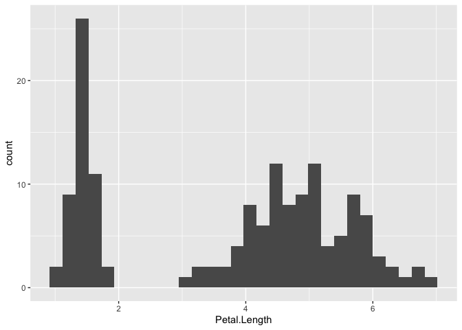<!-- -->

``` r
## use density for y axis.
p1<-df%>%
  ggplot(aes(x=Petal.Length,y = ..density..))+geom_histogram()

p1
```

    ## `stat_bin()` using `bins = 30`. Pick better value with `binwidth`.

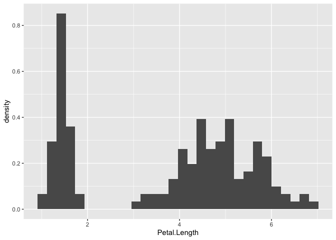<!-- -->

``` r
## color histogram by Species variable

# p2<-df%>%group_by(Species)%>%
#   ggplot(aes(x=Petal.Length,y = ..density.., fill=Species))+
#   geom_histogram()


p2<-df%>%
  ggplot(aes(x=Petal.Length,y = ..density..,     fill=Species))+geom_histogram()+facet_wrap(~Species)

p2
```

    ## `stat_bin()` using `bins = 30`. Pick better value with `binwidth`.

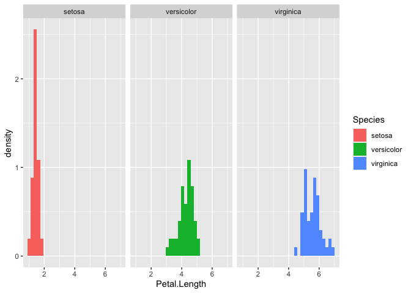<!-- -->

### 2.Boxplot

I want to make a boxplot, with`categorical variables`on the x-axis,
`numerical variables` on the y-axis, using variables with
`different levels of factor` as color mapping object.

``` r
## regular boxplot to show the distribution of Petal.Length with respect of different species

p<-df %>%
  ggplot(aes(x =Species,y=Petal.Length, fill=Species))+geom_boxplot()

p
```

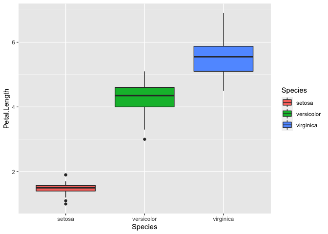<!-- -->

### 3.Parallel coordinates plot

I want to make a parallel coordinates plot,
with`multiple numerical variables's names`on the x-axis,
`numerical variables` on the y-axis, using variables with
`different levels of factor` as color mapping object.

``` r
library(GGally)
```

    ## Registered S3 method overwritten by 'GGally':
    ##   method from   
    ##   +.gg   ggplot2

``` r
ggparcoord(iris, columns = 1:4, groupColumn = 5, scale = "uniminmax") + 
  geom_line(size = 1.2)
```

<!-- -->

### 4.Scatter plot

I want to make a scatter plot, with`numerical variables`on the x-axis,
`numerical variables` on the y-axis, using variables with
`different levels of factor` as color mapping object.

``` r
## show to relationship between two variables
p<-df%>%
  ggplot(aes(x=Sepal.Length, y=Sepal.Width, color=Species))+geom_point(aes(shape=Species))

p
```

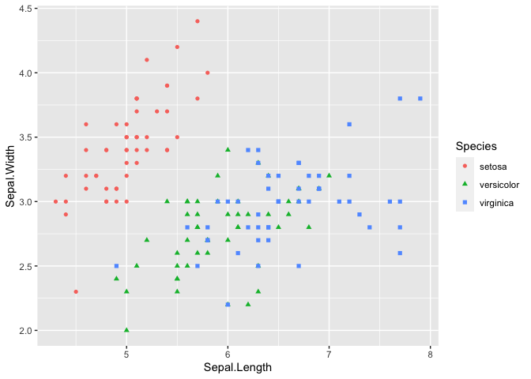<!-- -->

### 5.Ridgeline plot

I want to make a boxplot, with`numerical variables`on the x-axis,
`categorical variables` on the y-axis, using `density` as color mapping
object.

``` r
#Ridgeline plots are partially overlapping line plots that create the impression of a mountain range. They can be quite useful for visualizing changes in distributions over time or space.


library(ggridges)
p<-ggplot(iris, aes(x = Sepal.Length, y = Species, fill = 0.5 - abs(0.5 - stat(ecdf)))) +
  stat_density_ridges(geom = "density_ridges_gradient", calc_ecdf = TRUE) +
  scale_fill_viridis_c(name = "Tail probability", direction = -1)
p
```

    ## Picking joint bandwidth of 0.181

<!-- -->

### 6.Mosaic plot

I want to make a mosaic plot,x-axis is created by product(), e.g. x =
product(var2, var1)., using variables with `different levels of factor`
as color mapping object.

``` r
#The main hurdle ggmosaic faced is that mosaic plots do not have a one-to-one mapping between a variable and the x or y axis. To accommodate the variable number of variables, the mapping to x is created by the product() function. 

ftable(Titanic)
```

    ##                    Survived  No Yes
    ## Class Sex    Age                   
    ## 1st   Male   Child            0   5
    ##              Adult          118  57
    ##       Female Child            0   1
    ##              Adult            4 140
    ## 2nd   Male   Child            0  11
    ##              Adult          154  14
    ##       Female Child            0  13
    ##              Adult           13  80
    ## 3rd   Male   Child           35  13
    ##              Adult          387  75
    ##       Female Child           17  14
    ##              Adult           89  76
    ## Crew  Male   Child            0   0
    ##              Adult          670 192
    ##       Female Child            0   0
    ##              Adult            3  20

``` r
par(mar = c(2, 3.5, .1, .1))
mosaicplot(Titanic, shade = TRUE, main = "")
```

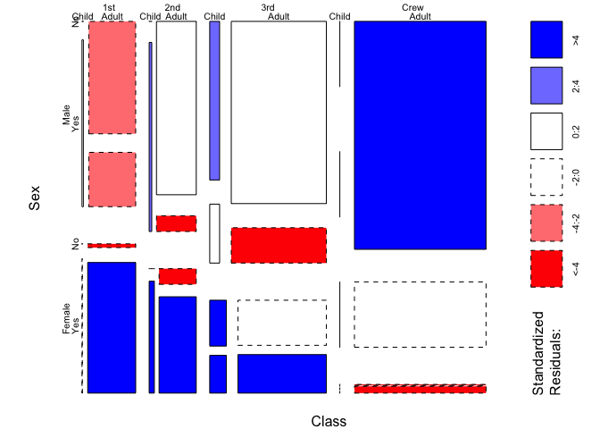<!-- -->

### 7.Pie chart

I want to make a pie chart, `numerical values` on the y-axis, using
variables with `different levels of factor` as color mapping object.

``` r
# Create Data
data <- data.frame(
  group=LETTERS[1:5],
  value=c(13,7,9,21,2)
)

# Basic piechart
ggplot(data, aes(x="", y=value, fill=group)) +
  geom_bar(stat="identity", width=1) +
  coord_polar("y", start=0)
```

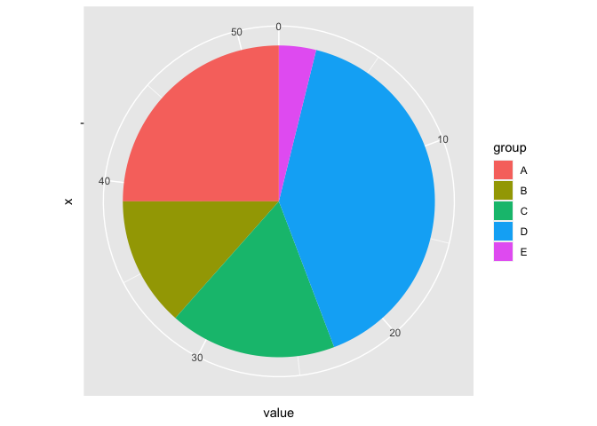<!-- -->

### 8.Heatmap

I want to make a heatmap, with`categorical variables`on the x-axis,
`categorical variables` on the y-axis, using `numeric variable` as color
mapping object.

``` r
library(RColorBrewer)
heatmap(as.matrix(mtcars), col = brewer.pal(9, "RdYlBu"), 
        scale = "column", margins = c(4, 8))
```

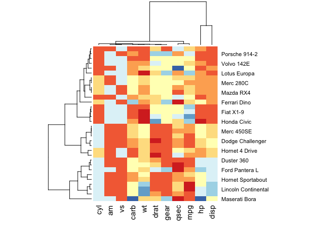<!-- -->

### 9.Map

I want to make a map, with`categorical variables`on the x-axis, using
`numeric values` as color mapping object.

``` r
if (require(maps)) {

  crimes <- data.frame(state = tolower(rownames(USArrests)), USArrests)

  # Equivalent to crimes %>% tidyr::pivot_longer(Murder:Rape)
  vars <- lapply(names(crimes)[-1], function(j) {
    data.frame(state = crimes$state, variable = j, value = crimes[[j]])
  })
  crimes_long <- do.call("rbind", vars)

  states_map <- map_data("state")
  ggplot(crimes, aes(map_id = state)) +
    geom_map(aes(fill = Murder), map = states_map) +
    expand_limits(x = states_map$long, y = states_map$lat)

  last_plot() + coord_map()
  ggplot(crimes_long, aes(map_id = state)) +
    geom_map(aes(fill = value), map = states_map) +
    expand_limits(x = states_map$long, y = states_map$lat) +
    facet_wrap( ~ variable)
}
```

    ## Loading required package: maps

    ## 
    ## Attaching package: 'maps'

    ## The following object is masked from 'package:purrr':
    ## 
    ##     map

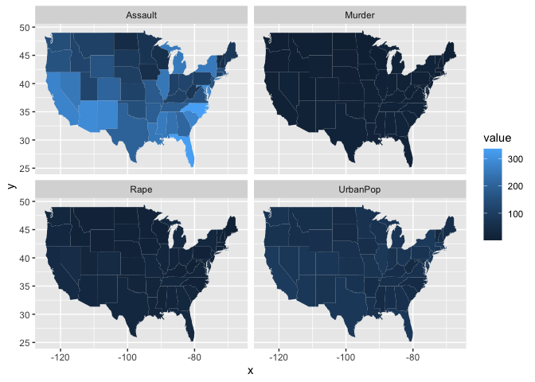<!-- -->

### 10.Violin plot

I want to make a violin plot, with`categorical variables`on the x-axis,
`numerical variables` on the y-axis, using variables with
`different levels of factor` as color mapping object.

``` r
p <- mtcars%>%
  ggplot(aes(x=factor(cyl), y=mpg, fill=factor(cyl)))+ geom_violin()

p
```

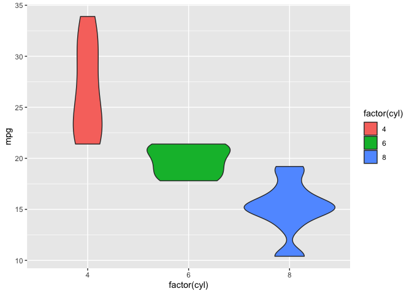<!-- -->

### 11.Survival plot

I want to make a survival plot, with`time variables`on the x-axis,
`numerical variables` on the y-axis, using variables with
`different levels of factor` as color mapping object.

``` r
library(survival)
leukemia.surv <- survfit(Surv(time, status) ~ x, data = aml)
plot(leukemia.surv, lty = 1:2, xlab = "time")
legend("topright", c("Maintenance", "No Maintenance"), lty = 1:2, bty = "n")
survminer::ggsurvplot(leukemia.surv, data = aml)
```

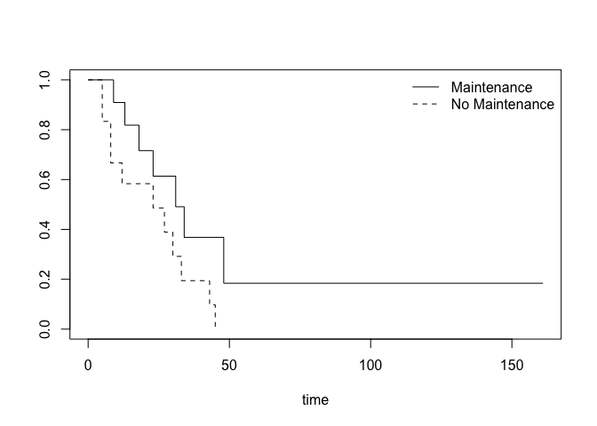<!-- -->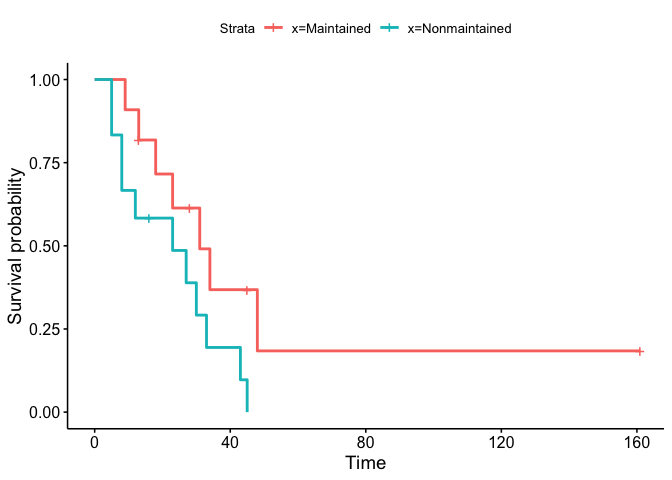<!-- -->
