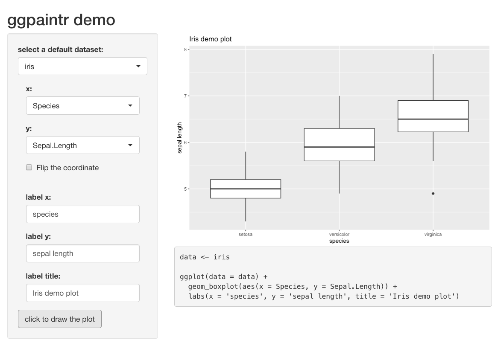
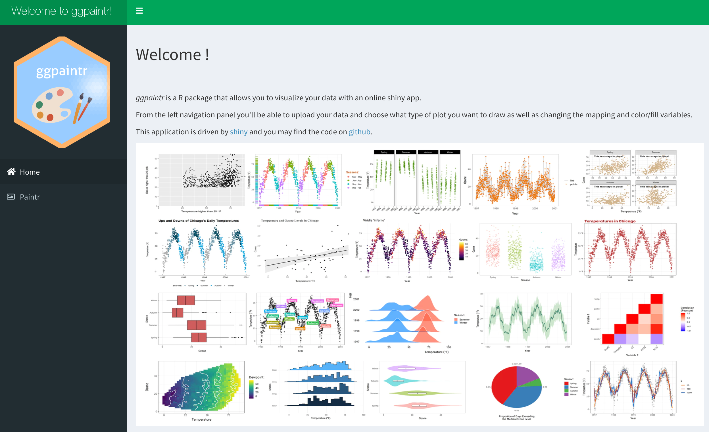
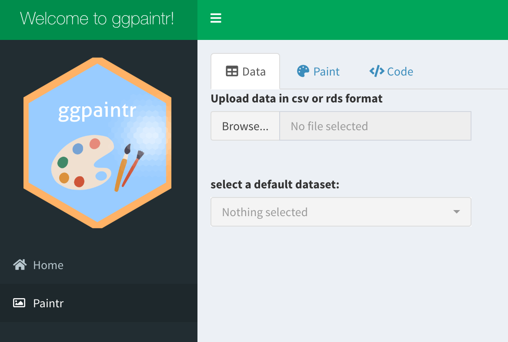
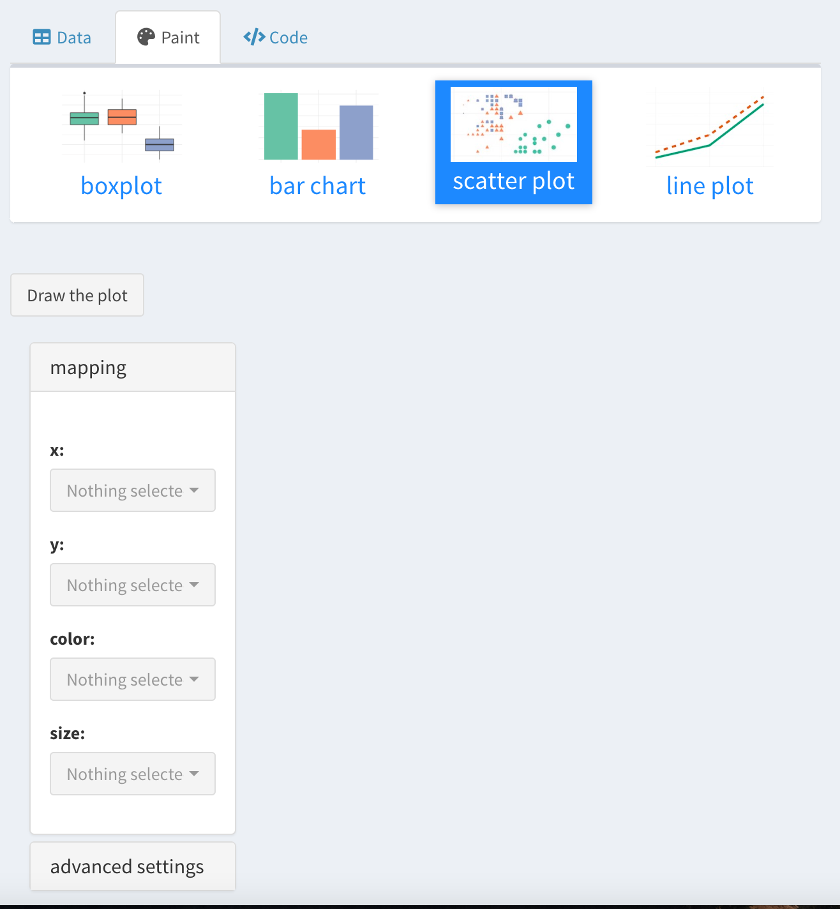
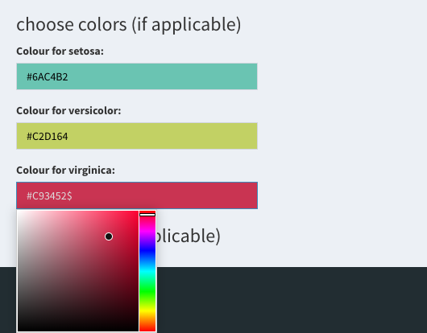
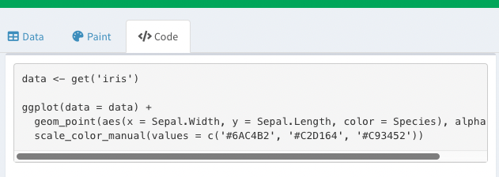

```{r setup, include=FALSE}
knitr::opts_chunk$set(
  collapse = TRUE,
  comment = "#>",
  fig.path = "figures/vignette-",
  echo=TRUE,
  warning = FALSE,
  message = FALSE,
  out.width = "100%"
)
```


## The Grammar of Graphics

The grammar of graphics is a tool that helps us explicitly and concisely define a graphic. Analogous to the grammar in English, the grammar of graphics tells us which "words" should be used to make up a "sentence". It allows users to create a complex graphic by assembling multiple independent components. 

The open-sourced R package **ggplot2** deals with this issue. **ggplot2** built a mapping from the data to geometric objects drawn on a coordinate system with parameters, such as scatters with multiple colors and shapes. As an example, the code to complete a line chart can include:

* A base layer with raw data;

* A layer for drawing the lines;

* A layer for specifying x, y labels and the title;

* A layer for legend settings;

* A layer for choosing background theme;

* ...

Each of the above functionalities can be modularized into one or several functions. Modules are assembled together according to the "grammar" of **ggplot2** to eventually show the graphic we desire. 

Compared to the plotting functions in vanilla R, **ggplot2** is more convenient to use, and has the advantage of higher flexibility and readability. 


## Why ggpaintr can be useful

In short, our package **ggpaintr** is <span style="color:red">a package for building shiny apps</span> that plots **ggplot2** objects.

**ggpaintr** is a collection of highly modularized shiny app components. It offers the possibility to build a shiny app for ggplot2 data visualization with minimum effort. The resulting shiny app can achieve broader functionality than the [ggplot GUI](https://shiny.gmw.rug.nl/ggplotgui), while the code to accomplish this is much more readable and logical. 

**ggpaintr** is a user-friendly package. Anyone with some knowledge of **ggplot2** can start building a shiny app with basic ggplot output like the one shown below, after a self-teaching of **ggpaintr** for less than 10 minutes: 

<!--  -->

```{r shinyiris1, echo=FALSE, fig.cap="Some Caption"}
knitr::include_graphics("images/ggpaintr_iris_1.png")
```


And more complex options and functionalities can be added and achieved using similar logic within a few lines of code. Currently **ggpaintr** has implemented most of the commonly used ggplot2 functions and their parameter options. You will learn in details about how to implement them in the next section.

We expect this package to be useful in the following scenarios:

* Statistical education of graphics

Our package offers a easier and more flexible way of building graphical shiny apps. Statistics instructors can develop interactive graphical UIs on their own with their specific demands. By transforming R's programming language into a point-and-click style, these UIs can be used to introduce different statistical graphics to fresh students in this field.

* Statistical education of R / ggplot2

Along with the plot, shiny apps built from our package also interactively show the complete R code for generating such plot. This can be extremely useful for beginners in R or ggplot2.

* Graphical demos in presentation

The most important characteristic of **ggpaintr** is that users can customize their app based on their demand and preference. We have implemented modules for most of the commonly used functionalities in ggplot2, and the grammar used in **ggpaintr** is also similar. As long as you are familiar with ggplot2, you should not find it hard to build your own shiny app. With some extra knowledge of shiny, you also have the ability to convert it into a fancier style as a formal presentation demo. 

### Installation

You can install the development version from Github with:

```{r, eval=FALSE, echo=TRUE}
# install.packages("devtools")
devtools::install_github("willju-wangqian/ggpaintr")
```


## Case Study 1: `ggpaintr` demo 

Let's revisit the demo shiny app presented in Figure X. After selecting a dataset, the shiny app allows users to map variables (or columns) in the dataset to `x` and `y`. It generates a plot using `ggplot2` and shows the corresponding `R` code. The reactivity on the mappings are built up so that changing mappings variables for `x` or `y` will change the resulting plot after clicking the "draw" button. Moreover, changing the selected dataset will automatically update the available choices for `x` and `y`. Without the help of `ggpaintr`, building such a shiny app at least requires the following steps:

- have UI components for `x` and `y` so that `input$x` and `input$y` are available
- dynamically render UI components for `x` and `y` so that the available choices depend on the selected data set
- figure out how to generate a `ggplot2` plot using `input$x` and `input$y` since the inputs are strings. One option is to use `aes_string()`
- figure out the `R` code for generating the resulting plot
- render the plot
- render the code

This might look involved, but what if this shiny app needs more functionalities? If the shiny app needs more mappings, such as `color` or `fill`, it will add more UI component, modify the server part so that the inputs can be correctly captured. If the shiny app wants to allow users to flip the coordinates using `coord_flip()` or adding labels using `labs()`, building this shiny app becomes even more involved. Additionally, maintaining and updating the shiny app can be challenging as well since many aspects of the shiny app would be modified.

However, we can build such a shiny app using `ggpaintr` with the following code. 

```{r, include = TRUE, eval = FALSE, attr.source='.numberLines'}
library(ggpaintr)
library(shiny)
library(tidyverse)
library(shinyWidgets)
library(palmerpenguins)

# Define UI for application that draws a histogram
ui <- fluidPage(
  
  # Application title
  titlePanel("ggpaintr demo"),
  
  # Sidebar with a slider input for number of bins
  sidebarLayout(
    sidebarPanel(
      pickerInput("defaultData", "select a default dataset:",
                  choices = c("iris", "mtcars","penguins", "faithfuld"),
                  selected = "",
                  multiple = TRUE,
                  options = pickerOptions(maxOptions = 1)),
      uiOutput("controlPanel"),
      actionButton("draw", "click to draw the plot"),
    ),
    
    # Show a plot of the generated distribution
    mainPanel(
      plotOutput("outputPlot"),
      verbatimTextOutput('outputCode')
    )
  )
)

# Define server logic required to draw a histogram
server <- function(input, output) {
  
  control_id <- "control_id"
  
  # data
  data_container <- reactive({
    req(input$defaultData)
    get(input$defaultData)
  })
  
  # construct paintr object
  paintr_rctv <- reactive({
    
    req(data_container())
    
    paintr(control_id,
           data_container(), data_path = input$defaultData,
           geom_boxplot(aes(x, y)) 
    )
    
  })
  
  # place ui
  output$controlPanel <- renderUI({
    req(paintr_rctv())
    
    column(
      12,
      paintr_get_ui(paintr_rctv(), "x"),
      paintr_get_ui(paintr_rctv(), "y"),
    )
  })
  
  # take results and plot
  observe({
    req(paintr_rctv(), data_container(), input$defaultData)
    data <- data_container()
    
    paintr_results <- paintr_plot_code(paintr_rctv())
    
    # Plot output
    output$outputPlot <- renderPlot({
      
      paintr_results[['plot']]
      
    })
    
    # Code output
    output$outputCode <- renderText({
      
      paintr_results[['code']]
      
    })
    
  }) %>% bindEvent(input$draw)
  
  
}

# Run the application
shinyApp(ui = ui, server = server)
```

Many things are hidden and handled by functions in `ggpaintr`, and we will talk about it in detail in the next section. Updating this shiny app can be relatively easy with the help of `ggpaintr`: by changing the `ggplot2` alike expression at line 51 into

```{r, echo=TRUE, eval=FALSE}
# add mapping for fill
geom_boxplot(aes(x, y, fill)) +
  coord_flip +        # allow users to flip coordinate
  labs(x, y, title)   # allow users to add labels for x-axis, y-axis, and title
```

and adding more elements in `output$controlPanel <- renderUI()` at line 57:

```{r, echo=TRUE, eval=FALSE}
# place ui
output$controlPanel <- renderUI({
  req(paintr_rctv())
  
  column(
    12,
    paintr_get_ui(paintr_rctv(), "x"),
    paintr_get_ui(paintr_rctv(), "y"),
    paintr_get_ui(paintr_rctv(), "fill"),
    paintr_get_ui(paintr_rctv(), "coord_flip"), # add UI for coord_flip()
    paintr_get_ui(paintr_rctv(), "labs"),       # add UI for labs()
  )
})
```

we can build a shiny app with the updated features as shown in Figure X. We can see that the shiny app now allows users to flip coordinates and set labels. The plot and corresponding `R` code can be updated accordingly as well.

```{r shinyiris2, echo=FALSE, fig.cap="Some Caption"}

```


## `ggpaintr` Design Desicisions

### Basic Structure

Making a shiny app with `ggpaintr` is straightforward. Since the UI components of mapping (and other plot settings like `coord_flip()` or `labs()`) are dynamically rendered, we will need a `uiOutput(id)` on the UI side that serves as a placeholder for the dynamically rendered UIs, like line 21 in the code of the demo shiny app. Another thing needed on the UI side is an action button, which is closely related to the design on the server side. On the server side, there are three building blocks that we need to take care of:

- creating a `paintr_obj` object using `ggpaintr::paintr()` as a reactive value (line 45). 

    ```{r, echo=TRUE, eval=FALSE}
    paintr(
      id,
      data,
      expr,
      extra_ui = NULL,
      extra_ui_args = NULL,
      data_path = "data"
    )
    ```

    `paintr()` is the main function of `ggpaintr` and returns a `paintr_obj` object. It expects three arguments: 
    - `id`: this ID will be used to create a `namespace` shared by all UI and module servers related to this `paintr_obj` object.
    - `data`: the dataset used to generate the plot
    - `expr`: an expression that controls which functionality should be included in the shiny app. 
    
    Note that wrapping the `paintr_obj` with `reactive()` is not required by the `paintr()` function, but required by the reactivity in the shiny app. Therefore, one can create a `paintr_obj` using `paintr()` and inspect its structure and elements even outside the context of a shiny app:
    
    ```{r, echo=TRUE, eval=FALSE}
    my_paintr <- paintr("id", iris, 
                        geom_boxplot(aes(x, y, fill)))
    ```

- extract the UI element using `ggpaintr::paintr_get_ui()` (line 62).

    ```{r, echo=TRUE, eval=FALSE}
    paintr_get_ui(
      paintr_obj,
      selected_ui_name,
      type = "ui",
      scope = NULL,
      verbose = FALSE
    )
    ```

    `paintr_get_ui()` expects a `paintr_obj` object and a selected key name for the ui. This selected key name can be any key name that has been implemented in `ggpaintr` or a user-defined key name. This will be discussed later in detail. `paintr_get_ui()` returns the UI element of the selected key name and returns `NULL` if the selected key name is not included in the `expr` of `paintr()`. `paintr_get_ui()` can be used to obtain the ID of the selected UI element if `type = "id"`. This is useful since the ID of the UI element of a selected key name can potentially be arbitrary if the UI function is user-defined.
    
- generate the plot and corresponding `R` code using `paintr_plot_code()` (line 72)

    ```{r, echo=TRUE, eval=FALSE}
    paintr_plot_code(
      paintr_obj,
      selected_color_rctv = NULL,
      selected_fill_rctv = NULL,
      color_fill = FALSE,
      color_group = FALSE,
      userFUN = NULL,
      ...
    )
    ```

    `paintr_plot_code()` takes a `paintr_obj` object and executes all of the module server functions in order to generate the resulting plot using `ggplot2` and the corresponding `R` code. Note that `paintr_plot_code()` is designed to be wrapped by `observeEvent()`, or equivalently by the combination of `observe` and `bindEvent` introduced by Shiny 1.6.0. The `isolate()` environment provided by `observeEvent()` can prevent the module server functions from execution when necessary pieces are missing. As a result, an action button that controls `paintr_plot_code()` and `observeEvent()` is expected on the UI side.
    
### Control with Expressions

The expression `expr` in `paintr()` is essential to the functionality of `ggpaintr`. It controls what type of plot the shiny app can make and what functionalities the shiny app provides. In general, a valid `expr` is as the following:

```{r, echo=TRUE, eval=FALSE}
geom_<chart>(aes(<mapping_1>, <mapping_2>, ...), <geom_args_1>, <geom_args_2>, ...) +
  <plot_settings_1> +
  <plot_settings_2> + 
  ...
```

- `geom_<chart>` can be any `geom_` functions in `ggplot2` as long as the required aesthetic mappings are correctly provided.
- `<mapping_*>` are the key names for the aesthetic mapping. Currently, we have implemented `x`, `y`, `z`, `fill`, `color`, `shape`, `size`, and `group`. These are the most commonly used aesthetic mappings and will allow users of the shiny app to select variables from the dataset for a specific mapping. The UI elements of these mapping key names are implemented with `shinyWidgets::pickerInput()`, which allow users to select and deselect.
- `<geom_args_*>` are the key names for arguments passed into the `geom_<chart>` function. Currently, we have implemented `alpha`, `size`, `position`, and `stat`. The UI elements of `size` and `alpha` accept numeric inputs, and the UI elements of `position` and `stat` are `shinyWidgets::pickerInput()`, which provides a list of options for the users. We are able to use strings to control `position` and `stat` but have not included all the string options. Since `position`, `stat`, and other arguments of a `geom_<chart>` can be very complicated in `ggplot2`. We plan to have a more sophisticated way of handling the arguments in the future.
- `<plot_settings_*>` are the key names for functions that can modify the plot in higher layers. Currently, we have implemented `coord_flip`, `facet_grid`, `theme_choose`, `scale_color`, `scale_fill`, `theme(legend.position, legend.direction, legend.box)`, and `labs(x, y, title, subtitle)`. Note that `theme_choose` allows users of the shiny app to choose themes from a list (`theme_gray()`, `theme_classic()`, `theme_bw()`, `theme_minimal()`) and is not a function in `ggplot2`. This shows that both the key names and the ui and server part associated with the key name can be customized. Another thing worth noting is that `theme()` in `ggplot2` is very powerful but we only have implementations for three of its parameters: `legend.position`, `legend.direction`, and `legend.box`. We were able to implement these three parameters because they require strings instead of `ggplot2::element_*`. `labs(x, y, title, subtitle)` is similar to `theme()`. And currently, `labs` can only set labels for `x`, `y`, `title`, and `subtitle`. `scale_color` and `scale_fill` will be discussed later.

### Modularity

The idea of modularized shiny app largely inspired our design of `ggpaintr`. Each key name, no matter it is `<mapping>`, `<geom_args>`, or `<plot_settings>`, can be considered as a module. It can have its own ui and server functions and is independent of other key names' modules. Once the key name is included in the `expr` of `paintr()`, its ui function will be executed when `paintr()` is called, and its server function will be executed when `paintr_plot_code()` is called. Modularization allows us to implement different modules independently and provides the possibility for other developers to include their own modules. It also provides the flexibility in building shiny apps using `ggpaintr`. At the same time, maintaining and updating certain features of a shiny app become easier since we only need to work on the module that is responsible for the change. 

### Flexibility in UI Design

Developers who build shiny apps using `ggpaintr` have a lot of freedom in their design of the user interface. The UI element of a key name can be obtained by `paintr_get_ui()`, and a developer has full control on how or where to put it in the shiny app. If the default UI element of a key name does not meet the need of a developer, one can provide their own ui functions and override the default. 

### Reactivity

`scale_color` and `scale_fill` allow users of the shiny app to manually select colors for `color` and `fill`, respectively. Since `color` and `fill` have similar behaviors, we will use `color` for further explanation. If a numerical variable is mapped to `color`, `scale_color_gradient()` is used, and users can select one color for `low` and another color for `high`; if a categorical variable is mapped to `color`, `scale_color_manual()` is used, and the colors selected by the users are passed into the parameter `values` of `scale_color_manual()`. If the categorical variable has more than 11 levels, the server function for `scale_color` will refuse to render the ui for choosing colors and give a warning message. 

The ui for choosing colors are implemented with `colourpicker::colourInput` and depends on the selected variable of `color` or `fill` mapping. That is, the reactivity between `scale_color` and `color` requires the existence of `color` and some user input, and thus it cannot be established at the same time when the reactive value of `paintr()` is created. To solve this problem, we implemented a function called `scaleColor_build_reactivity()`, which can establish the reactivity for both `color` and `fill`. 

```{r, echo=TRUE, eval=FALSE}
scaleColor_build_reactivity(
  id, 
  paintr_obj, 
  color_or_fill
)
```

- `id` should be the same `id` used for `paintr()`. This ensures that the modules share the same name space.
- `paintr_obj` is a reactive value of a `paintr_obj` object created by `paintr()`
- `color_or_fill` specifies `color` or `fill`

In order to add reactivity for `fill` in our demo shiny app, one should make the following changes:

- change the expression `expr` to include `scale_fill` and establish the reactivity:

    ```{r, echo=TRUE, eval=FALSE}
    paintr_rctv <- reactive({

        req(data_container())

        paintr(control_id,
               data_container(), data_path = input$defaultData,
               geom_boxplot(aes(x, y, fill)) +
                   coord_flip +
                   labs(x, y, title) +
                   scale_fill
        )
    })
    
    scale_fill_rctv <- scaleColor_build_reactivity(control_id, paintr_rctv, "fill")
    ```
    
- modify the ui output:

    ```{r, echo=TRUE, eval=FALSE}
    output$controlPanel <- renderUI({
        req(paintr_rctv())
    
        column(
            12,
            paintr_get_ui(paintr_rctv(), "x"),
            paintr_get_ui(paintr_rctv(), "y"),
            paintr_get_ui(paintr_rctv(), "fill"),
            paintr_get_ui(paintr_rctv(), "coord_flip"),
            paintr_get_ui(paintr_rctv(), "labs"),
            paintr_get_ui(paintr_rctv(), "scale_fill") # added for scale_fill
        )
    })
    ```

- pass the reactive object `scale_fill_rctv` into `paintr_plot_code()`

    ```{r, echo=TRUE, eval=FALSE}
    paintr_results <- paintr_plot_code(paintr_rctv(),
                                       selected_fill_rctv = scale_fill_rctv)
    ```


### Extensibility

This part needs some future work. 


## Case Study 2: `ggpaintr_app` 

A shiny app called `ggpaintr_app` is built with the `ggpaintr` package and included in the package. `ggpaintr_app` not only demonstrates the functionality of `ggpaintr`, but also serves as a shiny app for those unfamiliar with the Grammar of Graphics or ggplot2 but want to create a plot using ggplot2. Some design of `ggpaintr_app` can also provide reference for package/shiny app developers. 

### Run the shiny app

```{r, eval=FALSE, echo=TRUE}
library(ggpaintr)

run_ggpaintr_app()
```

### Home page 

Our **Home** page gives a brief introduction about the **ggpaintr** package and the corresponding shiny app,it also includes our GitHub repository link, which can direct users to our package codes if needed. 

```{r, echo=FALSE, out.width="100%", fig.cap="Homepage."}

```


### Paintr page

The **Paintr** page is the main user interface of the app, this page is further divided into three tabs, which are **Data**, **Paint**, and **Code**. 

#### 1.`Data` tab

Under **Data**, users are allowed to either upload data set from their local file folders, or select a data set from Base R database. 

```{r, echo=FALSE, out.width="100%", fig.cap="Paintr page."}

```

Once the data set is loaded, users can see partial example of the data set and even filter the data before moving to the next step.

```{r, echo=FALSE, out.width="100%", fig.cap="Filter function."}
knitr::include_graphics("images/filter.png")
```

#### 2.`Paint` tab 

Under **Paint**, there are image icons to present all types of plots currently available in our shiny app, these image icons allow users to choose the type of plot they would like to draw in a more intuitive manner. 

Once the type of plot is chosen, the corresponding mapping options box will pop up. Here, we have embedded **basic mapping** options such as `x`, `y`, `color`, `fill`, and `size`; we also included **advanced setting** where users can modify the `legend`,`coordinate`, `theme`, `labels` or facet the plot.

```{r, echo=FALSE, out.width="100%", fig.cap="Paint page."}

```

What's more, in order to meet different aesthetic needs, it also allows users to freely choose colors for their plots.

```{r, echo=FALSE, out.width="100%", fig.cap="Paint page."}

```

Once all the mapping variables and setting options are chosen, users can click the **Draw the plot** button and the plot will show up automatically. Here is an example of a scatter plot drew with the iris data.


```{r, echo=FALSE, out.width="100%", fig.cap="Example plot."}
knitr::include_graphics("images/scatterplot.png")
```

#### 3.`Code` tab 

Although we have included most of the mapping and aesthetic options for drawing a plot in our shiny app, we want to give users more freedom to modify their plots if needed. Therefore, the code for drawing the plot will also be provided once a plot is made. Simply copy and paste the code into R console and run it will generate an identical plot as the shiny app does. Modify the codes and draw your dream plot is also encouraged.

```{r, echo=FALSE, out.width="100%", fig.cap="Example code."}

```


