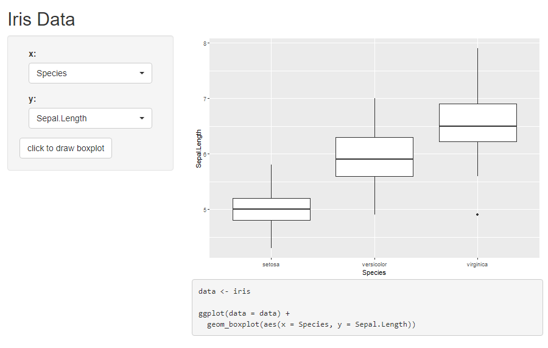

## The Grammar of Graphics

The grammar of graphics is a tool that helps us explicitly and concisely define a graphic. Analogous to the grammar in English, the grammar of graphics tells us which "words" should be used to make up a "sentence". It allows users to create a complex graphic by assembling multiple independent components. 

The open-sourced R package **ggplot2** deals with this issue. **ggplot2** built a mapping from the data to geometric objects drawn on a coordinate system with parameters, such as scatters with multiple colors and shapes. As an example, the code to complete a line chart can include:

  * A base layer with raw data;
      
  * A layer for drawing the lines;
      
  * A layer for specifying x, y labels and the title;
      
  * A layer for legend settings;
      
  * A layer for choosing background theme;
      
  * ...

Each of the above functionalities can be modularized into one or several functions. Modules are assembled together according to the "grammar" of **ggplot2** to eventually show the graphic we desire. 

Compared to the plotting functions in vanilla R, **ggplot2** is more convenient to use, and has the advantage of higher flexibility and readability. 


## Why ggpaintr can be useful

In short, our package **ggpaintr** is <span style="color:red">a package for building shiny apps</span> that plots **ggplot2** objects.

**ggpaintr** is a collection of highly modularized shiny app components. It offers the possibility to build a shiny app for ggplot2 data visualization with minimum effort. The resulting shiny app can achieve broader functionality than the [ggplot GUI](https://shiny.gmw.rug.nl/ggplotgui), while the code to accomplish this is much more readable and logical. 

**ggpaintr** is a user-friendly package. Anyone with some knowledge of **ggplot2** can start building a shiny app with basic ggplot output like the one shown below, after a self-teaching of **ggpaintr** for less than 10 minutes: 

```{r, include = FALSE, eval = FALSE}
library(ggpaintr)
data <- iris

# Define UI for application that draws a histogram
ui <- fluidPage(
    titlePanel("Boxplot for Iris Data"),

    # Sidebar with a slider input for number of bins
    sidebarLayout(
        sidebarPanel(
            uiOutput("someUI"),
            actionButton("draw", "label: draw"),
        ),

        mainPanel(
            plotOutput("mainPlot"),
            verbatimTextOutput('mycode')
        )
    )
)

# Define server logic required to draw a histogram
server <- function(input, output) {

    box_control_id <- "boxControl"
    ns_box <- NS(box_control_id)

    code_container <- reactiveValues()
    code_container[['data']] <- "iris"


    # construct paintr object
    box_main <- reactive({
        paintr(
            box_control_id,
            names(data),
            expr(
              geom_boxplot(aes(x, y))
            )
        )

    })

    # place ui
    output$someUI <- renderUI({
        req(box_main())
        column(12,
            paintr_get_ui(box_main(), "x"),
            paintr_get_ui(box_main(), "y")
        )
    })

    # take results and plot
    observe({
        req(box_main())
        paintr_list <- paintr_plot_code(box_main(), box_control_id, data)

        results <- get_plot_code(paintr_list,
                                 data = data,
                                 data_path = code_container[['data']])

        output$mainPlot <- renderPlot({
          results[['plot']]
        })

        output$mycode <- renderText({
          results[['code']]
        })

    }) %>% bindEvent(input$draw)
}

shinyApp(ui = ui, server = server)
```



And more complex options and functionalities can be added and achieved using similar logic within a few lines of code. Currently **ggpaintr** has implemented most of the commonly used ggplot2 functions and their parameter options. You will learn in details about how to implement them in the next section.

We expect this package to be useful in the following scenarios:
  
  * Statistical education of graphics
      
    Our package offers a easier and more flexible way of building graphical shiny apps. Statistics instructors can develop interactive graphical UIs on their own with their specific demands. By transforming R's programming language into a point-and-click style, these UIs can be used to introduce different statistical graphics to fresh students in this field.
        
  * Statistical education of R / ggplot2
      
    Along with the plot, shiny apps built from our package also interactively show the complete R code for generating such plot. This can be extremely useful for beginners in R or ggplot2.
      
  * Graphical demos in presentation
      
    The most important characteristic of **ggpaintr** is that users can customize their app based on their demand and preference. We have implemented modules for most of the commonly used functionalities in ggplot2, and the grammar used in **ggpaintr** is also similar. As long as you are familiar with ggplot2, you should not find it hard to build your own shiny app. With some extra knowledge of shiny, you also have the ability to convert it into a fancier style as a formal presentation demo. 
  
  
  
  
  
  
  
  
  
  
  
  
