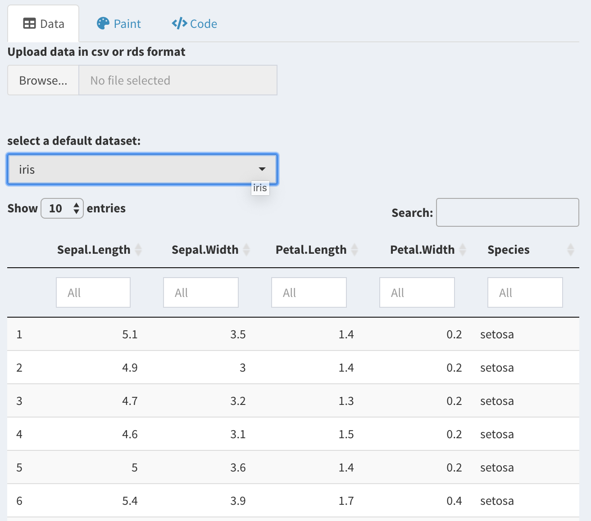

```{r setup, include = FALSE}
knitr::opts_chunk$set(
  collapse = TRUE,
  comment = "#>",
  fig.path = "figures/vignette-",
  echo=FALSE,
  warning = FALSE,
  message = FALSE,
  fig.width = 7,
  fig.height = 5,
  out.width = "80%"
)
library(tidyverse)
theme_set(theme_bw())
```


## Installation

You can install the development version from Github with:

```{r, eval=FALSE, echo=TRUE}
# install.packages("devtools")
devtools::install_github("willju-wangqian/ggpaintr")
```

## Run the shiny app

```{r, eval=FALSE, echo=TRUE}
library(ggpaintr)

run_ggpaintr_app()
```

## The `ggpaintr` Shiny App 

This part is meant to briefly showcase a more sophisticated shiny application built with the **ggpaintr** package. The **ggpaintr** shiny app can not only be utilized by ordinary users, but also can provide reference for package/shiny app developers. 

### Home page 

Our **Home** page gives a brief introduction about the **ggpaintr** package and the corresponding shiny app,it also includes our GitHub repository link, which can direct users to our package codes if needed. 

```{r, echo=FALSE, out.width="100%", fig.cap="Homepage."}

```


### Paintr page

The **Paintr** page is the main user interface of the app, this page is further divided into three tabs, which are **Data**, **Paint**, and **Code**. 

#### 1.`Data` tab

Under **Data**, users are allowed to either upload data set from their local file folders, or select a data set from Base R database. 


```{r, echo=FALSE, out.width="100%", fig.cap="Paintr page."}
knitr::include_graphics("images/paintrpage.png")
```

Once the data set is loaded, users can see partial example of the data set and even filter the data before moving to the next step.

```{r, echo=FALSE, out.width="100%", fig.cap="Filter function."}

```

#### 2.`Paint` tab 

Under **Paint**, there are image icons to present all types of plots currently available in our shiny app, these image icons allow users to choose the type of plot they would like to draw in a more intuitive manner. 

Once the type of plot is chosen, the corresponding mapping options box will pop up. Here, we have embedded **basic mapping** options such as `x`, `y`, `color`, `fill`, and `size`; we also included **advanced setting** where users can modify the `legend`,`coordinate`, `theme`, `labels` or facet the plot.

```{r, echo=FALSE, out.width="100%", fig.cap="Paint page."}
knitr::include_graphics("images/Paint.png")
```

What's more, in order to meet different aesthetic needs, it also allows users to freely choose colors for their plots.

```{r, echo=FALSE, out.width="100%", fig.cap="Paint page."}
knitr::include_graphics("images/choosecolor.png")
```

Once all the mapping variables and setting options are chosen, users can click the **Draw the plot** button and the plot will show up automatically. Here is an example of a scatter plot drew with the iris data.


```{r, echo=FALSE, out.width="100%", fig.cap="Example plot."}
knitr::include_graphics("images/scatterplot.png")
```

#### 3.`Code` tab 

Although we have included most of the mapping and aesthetic options for drawing a plot in our shiny app, we want to give users more freedom to modify their plots if needed. Therefore, the code for drawing the plot will also be provided once a plot is made. Simply copy and paste the code into R console and run it will generate an identical plot as the shiny app does. Modify the codes and draw your dream plot is also encouraged.

```{r, echo=FALSE, out.width="100%", fig.cap="Example code."}

```


